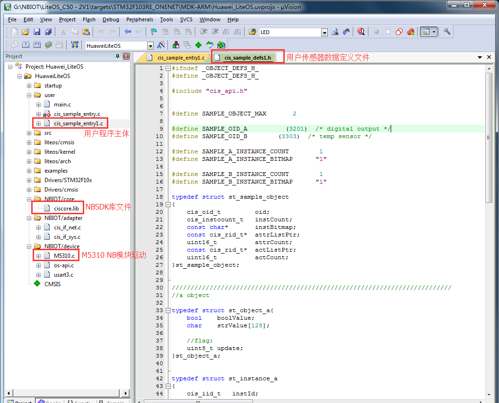
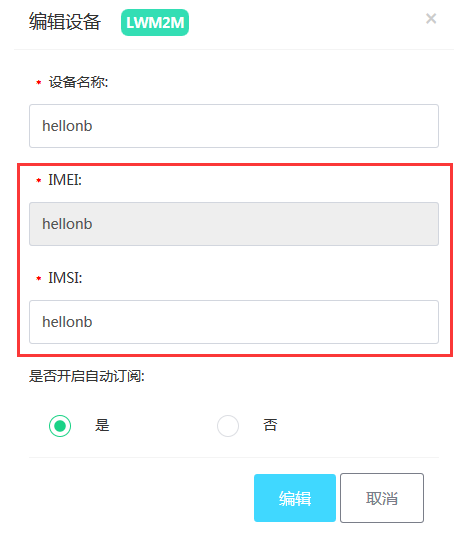
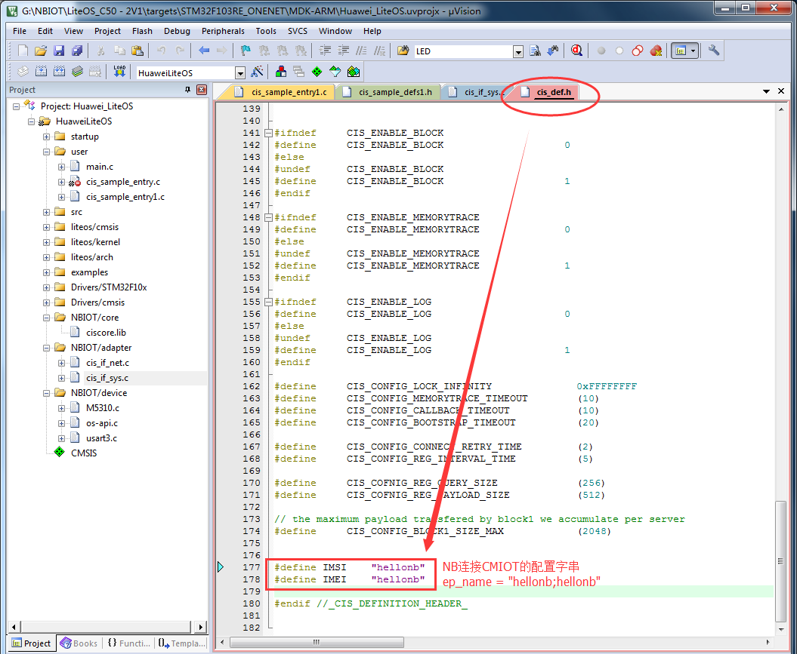
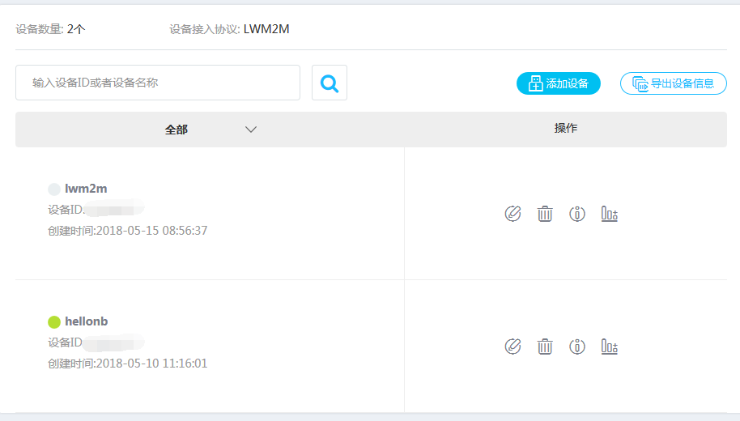
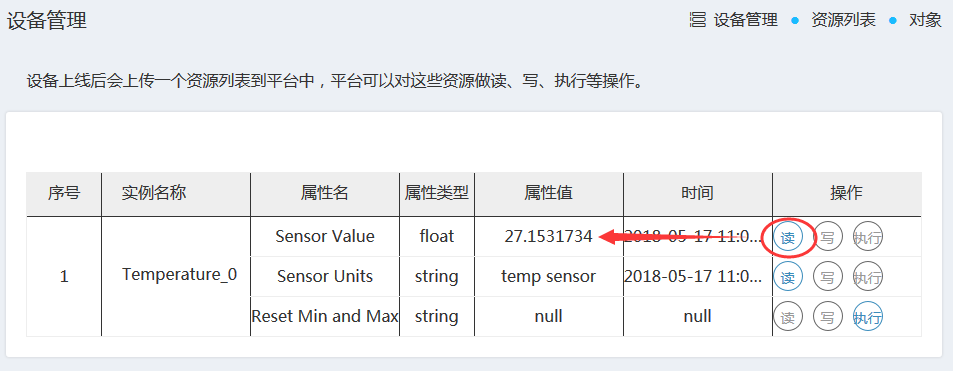
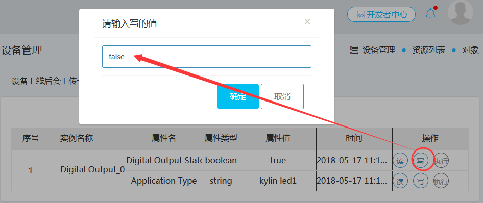
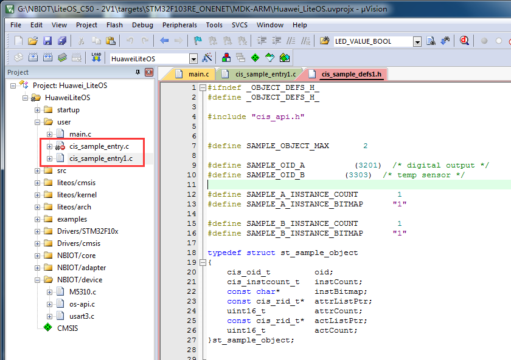
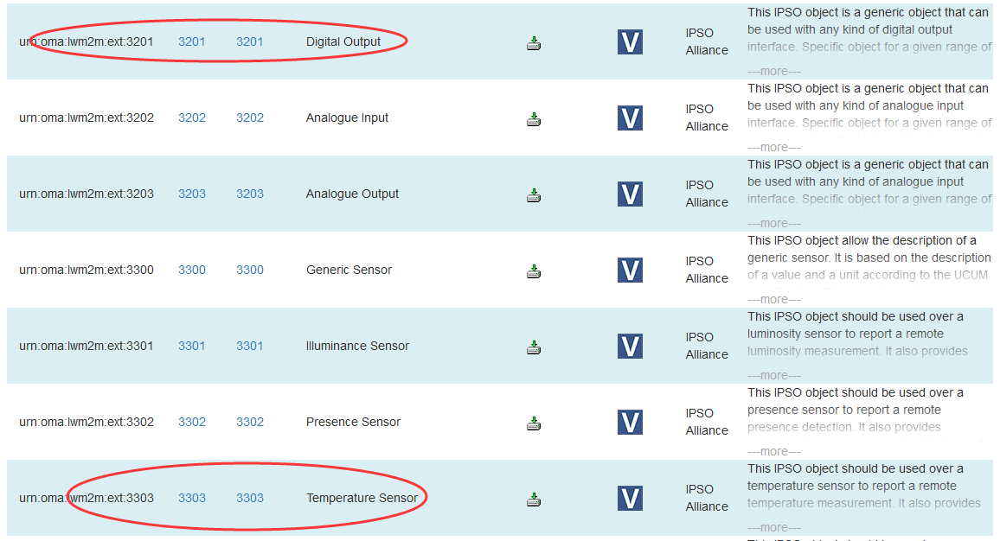
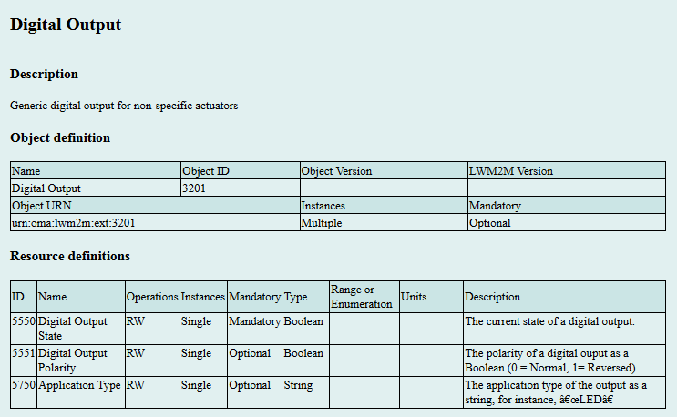

# 中国移动 OneNet 云平台 

## NBSDK 开发环境简介

	IDE软件版本：KEIL uVersion V5.24。
	NBSDK版本  ：V2.1
	LiteOS版本 ：[V2.1](https://github.com/LiteOS/LiteOS)

- 编译环境如下图：

- 通过NBSDK连接CMIOT，需要配置程序的IMEI、IMSI值与平台NB设备的该值一致。如下图：

- 打开cis_def.h头文件，修改文件结尾的IMSI与IMEI的值为平台设备的该值，重新编译下载到NB开发板，即可连接到平台。如下图：

- NB开发板上电后十秒左右，打开OneNet平台，可以看到NB设备在线绿灯亮起。如下图

- 点击在线的NB设备，打开NB开发板sensor设备信息，如下图

- 可以看到开发板有一个温度传感器实例，和一个数字输出示例，点击Temperature对象，可以查看对象的实例的资源属性信息。我们点击一下Sensor Value的读操作标志，会读取到NB开发板所处的温度信息，多次的读操作，可以看到温度的变化。如下图

- 点击Digital Output对象，可以查看对象的实例的资源属性信息。我们点击Digital Output State的写操作标志，填写false并确定，同时观察NB开发板的LED1，发现灯熄灭了；再次写入true，会发现LED1又被点亮了。如下图

## NBSDK应用移植简介

- 主要参考《NB-IOT 协议接入说明文档》，以及NBSDK官方sample源码。实际的应用可以参考cis_sample_entry.c和cis_sample_defs.h文件，我们这里新建了cis_sample_entry1.c和cis_sample_defs1.h给应用添加了一个温度传感器，和一个LED灯。如下图：

- OneNet支持标准的object ID，可以参考如下网站获取标准object ID号及资源ID号：[http://www.openmobilealliance.org/wp/OMNA/LwM2M/LwM2MRegistry.html](http://www.openmobilealliance.org/wp/OMNA/LwM2M/LwM2MRegistry.html)。可以查到数字输出和温度传感器的object ID分别为3201和3303。如下图

- 我们点击3201进入Digital Output的资源定义的描述文件，可以看到如下资源信息：

- 修改源码：我们定义2个对象，数字输出和温度传感器，分别定义1个对象的实例。如下图。对象资源的定义信息详见源码：

- 为适应自身应用，用户需要修改cis_sample_entry.c里的如下回调函数，如下图：

- 实际应用请参考最新版本的[《NB-IOT 协议接入说明文档》](https://open.iot.10086.cn/doc/art431.html#118)。

## 获取源码

* 获取OneNet NBSDK源码，需先签署NDA协议。
* [OneNET 合作入口](https://open.iot.10086.cn/)
