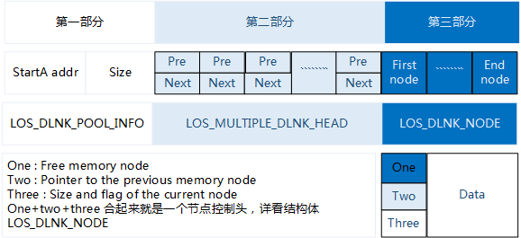

# 内存  

[[toc]]

## 概述

### 基本概念

内存管理模块管理系统的内存资源，它是操作系统的核心模块之一。主要包括内存的初始化、分配以及释放。  

在系统运行过程中，内存管理模块通过对内存的申请/释放操作，来管理用户和OS对内存的使用，使内存的利用率和使用效率达到最优，同时最大限度地解决系统的内存碎片问题。  

Huawei LiteOS的内存管理分为静态内存管理和动态内存管理，提供内存初始化、分配、释放等功能。  

- 动态内存：在动态内存池中分配用户指定大小的内存块。   

	- 优点：按需分配。   

	- 缺点：内存池中可能出现碎片。  

- 静态内存：在静态内存池中分配用户初始化时预设（固定）大小的内存块。  

	- 优点：分配和释放效率高，静态内存池中无碎片。  

	- 缺点：只能申请到初始化预设大小的内存块，不能按需申请。  

### 动态内存运作机制

动态内存管理，即在内存资源充足的情况下，从系统配置的一块比较大的连续内存（内存池），根据用户需求，分配任意大小的内存块。当用户不需要该内存块时，又可以释放回系统供下一次使用。 

与静态内存相比，动态内存管理的好处是按需分配，缺点是内存池中容易出现碎片。   

LiteOS动态内存支持 DLINK 和 BEST LITTLE 两种标准算法。

#### 1. DLINK

DLINK动态内存管理结构如下图所示：



**第一部分：** 堆内存（也称内存池）的起始地址及堆区域总大小。  

**第二部分：** 本身是一个数组，每个元素是一个双向链表，所有free节点的控制头都会被分类挂在这个数组的双向链表中。  

假设内存允许的最小节点为 2<sup>min</sup> 字节，则数组的第一个双向链表存储的是所有 size 为2 <sup>min</sup> < size < 2<sup>min+1</sup> 的 free 节点，第二个双向链表存储的是所有 size 为 2<sup>min+1</sup> < size < 2<sup>min+2</sup> 的 free 节点，依次类推第 n 个双向链表存储的是所有 size 为 2<sup>min+n-1</sup> < size < 2<sup>min+n</sup> 的 free 节点。每次申请内存的时候，会从这个数组检索最合适大小的 free 节点，进行分配内存。每次释放内存时，会将该片内存作为 free 节点存储至这个数组，以便下次再利用。

**第三部分：** 占用内存池极大部分的空间，是用于存放各节点的实际区域。以下是`LOS_MEM_DYN_NODE`节点结构体申明以及简单介绍：  
```c
typedef struct tagLOS_MEM_DYN_NODE  
{  
LOS_DL_LIST stFreeNodeInfo;  
struct tagLOS_MEM_DYN_NODE *pstPreNode;  
UINT32 uwSizeAndFlag;  
}LOS_MEM_DYN_NODE;    
```


#### 2. BEST LITTLE

LiteOS 的动态内存分配支持最佳适配算法，即 BEST LITTLE，每次分配时选择内存池中最小最适合的内存块进行分配。LiteOS 动态内存管理在最佳适配算法的基础上加入了 SLAB 机制，用于分配固定大小的内存块，进而减小产生内存碎片的可能性。  

LiteOS 内存管理中的 SLAB 机制支持可配置的 SLAB CLASS 数目及每个 CLASS 的最大空间，现以 SLAB CLASS 数目为 4，每个 CLASS 的最大空间为 512 字节为例说明 SLAB 机制。在内存池中共有 4 个 SLAB CLASS，每个 SLAB CLASS 的总共可分配大小为 512 字节，第一个 SLAB CLASS 被分为 32 个16 字节的 SLAB 块，第二个 SLAB CLASS 被分为 16 个 3 2字节的 SLAB 块，第三个 SLAB CLASS 被分为 8 个 64 字节的 SLAB 块，第四个 SLAB CLASS 被分为 4 个 128 字节的 SLAB 块。这 4 个 SLAB CLASS 是从内存池中按照最佳适配算法分配出来的。  

初始化内存管理时，首先初始化内存池，然后在初始化后的内存池中按照最佳适配算法申请 4 个 SLAB CLASS，再逐个按照 SLAB 内存管理机制初始化 4 个 SLAB CLASS。  

每次申请内存时，先在满足申请大小的最佳 SLAB CLASS 中申请，（比如用户申请 20 字节内存，就在 SLAB 块大小为 32 字节的 SLAB CLASS 中申请），如果申请成功，就将 SLAB 内存块整块返回给用户，释放时整块回收。如果满足条件的 SLAB CLASS 中已无可以分配的内存块，则继续向内存池按照最佳适配算法申请。需要注意的是，如果当前的 SLAB CLASS 中无可用 SLAB 块了，则直接向内存池申请，而不会继续向有着更大 SLAB 块空间的 SLAB CLASS 申请。    

释放内存时，先检查释放的内存块是否属于 SLAB CLASS，如果是 SLAB CLASS 的内存块，则还回对应的 SLAB CLASS 中，否则还回内存池中。  


### 静态内存运作机制

静态内存实质上是一块静态数组，静态内存池内的块大小在初始化时设定，初始化后块大小不可变更。  

静态内存池由一个控制块和若干相同大小的内存块构成。控制块位于内存池头部，用于内存块管理。内存块的申请和释放以块大小为粒度。 

静态内存示意图


## 动态内存

### 开发指导

#### 使用场景

内存管理的主要工作是动态的划分并管理用户分配好的内存区间。  

动态内存管理主要是在用户需要使用大小不等的内存块的场景中使用。  

当用户需要分配内存时，可以通过操作系统的动态内存申请函数索取指定大小内存块，一旦使用完毕，通过动态内存释放函数归还所占用内存，使之可以重复使用。  

#### 功能

Huawei LiteOS 系统中的动态内存管理模块为用户提供下面几种功能，具体的API详见接口手册。

| 功能分类                   | 接口名                    | 描述                                                             |
|----------------------------|---------------------------|------------------------------------------------------------------|
| 内存初始化                 | `LOS_MemInit`              | 初始化一块指定的动态内存池，大小为size。                         |
| 申请动态内存               | `LOS_MemAlloc`             | 从指定动态内存池中申请size长度的内存。                           |
| 释放动态内存               | `LOS_MemFree`              | 释放已申请的内存。                                               |
| 重新申请内存               | `LOS_MemRealloc`           | 按size大小重新分配内存块，并保留原内存块内容。                   |
| 内存对齐分配               | `LOS_MemAllocAlign`        | 从指定动态内存池中申请长度为size且地址按boundary字节对齐的内存。 |
| 分析内存池状态             | `LOS_MemStatisticsGet`     | 获取指定内存池的统计信息                                         |
| 查看内存池中最大可用空闲块 | `LOS_MemGetMaxFreeBlkSize` | 获取指定内存池的最大可用空闲块                                   |

#### DLINK开发流程

1.  配置：

`OS_SYS_MEM_ADDR`：系统动态内存池起始地址，一般不需要修改。  

`OS_SYS_MEM_SIZE`：系统动态内存池大小，以 byte 为单位，系统默认分配 DDR 后未使用的空间。  

`LOSCFG_BASE_MEM_NODE_INTEGRITY_CHECK`：内存越界检测开关，默认关闭。打开后，每次申请动态内存时执行动态内存块越界检查；每次释放静态内存时执行静态内存块越界检查。 

2.  初始化 `LOS_MemInit`。

初始一个内存池后如图，生成一个 EndNode，并且剩余的内存全部被标记为 FreeNode 节点。 

EndNode 作为内存池末尾的节点，size 为 0。 


3.  申请任意大小的动态内存 `LOS_MemAlloc`。

判断动态内存池中是否存在申请量大小的空间，若存在，则划出一块内存块，以指针形式返回，若不存在，返回 NULL。  

调用三次 `LOS_MemAlloc` 函数可以创建三个节点,假设名称分别为 UsedA，UsedB，UsedC，大小分别为 sizeA，sizeB，sizeC。因为刚初始化内存池的时候只有一个大的 FreeNode，所以这些内存块是从这个 FreeNode 中切割出来的。 


当内存池中存在多个 FreeNode 的时候进行 `malloc`，将会适配最合适大小的 FreeNode 用来新建内存块，减少内存碎片。若新建的内存块不等于被使用的FreeNode 的大小，则在新建内存块后，多余的内存又会被标记为一个新的 FreeNode。 

4.  释放动态内存 `LOS_MemFree`。  

回收内存块，供下一次使用。  

假设调用 `LOS_MemFree` 释放内存块UsedB，则会回收内存块 UsedB，并且将其标记为 FreeNode。 


#### BEST LITTLE开发流程

1. 配置：

`OS_SYS_MEM_ADDR`：系统动态内存池起始地址，需要用户指定。  

`OS_SYS_MEM_SIZE`：系统动态内存池大小，以 byte 为单位，需要用户正确计算。  

`LOSCFG_MEMORY_BESTFIT`：置为 YES，选中内存管理算法中的 BESTFIT 算法。  

`LOSCFG_KERNEL_MEM_SLAB`：置为 YES，打开内存管理中的SLAB机制。  

`SLAB_MEM_COUNT`：该配置位于内核中，一般不需要改动，表示 SLAB CLASS 的数量，目前内核初始化为 4。  

`SLAB_MEM_ALLOCATOR_SIZE`：该配置位于内核中，一般不需要改动，表示每个 SLAB CLASS 的最大可分配的块的总空间。  

`SLAB_BASIC_NEED_SIZE`：该配置位于内核中，一般不需要改动，表示初始化 SLAB 机制时需要的最小的堆空间。如果改动了 SLAB_MEM_COUNT 和 SLAB_MEM_ALLOCATOR_SIZE 的配置，就需要同步改动这个配置。  

2. 初始化：  

调用 `LOS_MemInit` 函数初始化用户指定的动态内存池，若用户使能了 SLAB 机制并且内存池中的可分配内存大于 SLAB 需要的最小内存，则会进一步初始化 SLAB CLASS。   

3. 申请任意大小的动态内存：  

调用 `LOS_MemAlloc` 函数从指定的内存池中申请指定大小的内存块，申请时内存管理先向 SLAB CLASS 申请，申请失败后继续向堆内存空间申请，最后将申请结果返回给用户。在向堆内存空间申请时，会存在内存块的切分。   
  
4. 释放动态内存：  

调用 `LOS_MemFree` 函数向指定的动态内存池释放指定的内存块，释放时会先判断该内存块是否属于 SLAB CLASS，若属于，则将该内存块还回 SLAB CLASS。否则，向堆内存空间释放内存块。在向堆内存空间释放时，会存在内存块的合并。  

### 注意事项

- 由于系统中动态内存管理需要消耗管理控制块结构的内存，故实际用户可使用空间总量小于在配置文件 `los_config.h` 中配置项 `OS_SYS_MEM_SIZE` 的大小。  

- 系统中地址对齐申请内存分配 `LOS_MemAllocAlign` 可能会消耗部分对齐导致的空间，故存在一些内存碎片，当系统释放该对齐内存时，同时回收由于对齐导致的内存碎片。  

- 系统中重新分配内存 `LOS_MemRealloc` 函数如果分配成功，系统会自己判定是否需要释放原来申请的空间，返回重新分配的空间。用户不需要手动释放原来的空间。  

- 系统中多次调用 `LOS_MemFree` 时，第一次会返回成功，但对同一块内存进行多次重复释放会导致非法指针操作，导致结果不可预知。  

### 编程实例

Huawei LiteOS运行期间，用户需要频繁的使用内存资源，而内存资源有限，必须确保将有限的内存资源分配给急需的程序，同时释放不用的内存。  

通过Huawei LiteOS内存管理模块可以保证高效、正确的申请、释放内存。  

本实例执行以下步骤：  

1.  初始化一个动态内存池。  

2.  在动态内存池中申请一个内存块。  

3.  使用这块内存块存放一个数据。  

4.  打印出存放在内存块中的数据。 

5.  释放掉这块内存。  

```c
UINT32 Example_Dyn_Mem(VOID)
{
    UINT32 *p_num = NULL;
    UINT32 uwRet;
    uwRet = LOS_MemInit(m_aucSysMem0, OS_SYS_MEM_SIZE);
    if (LOS_OK == uwRet)
    {
        dprintf("mempool init ok!\n");//内存初始化成功！
    }
    else
    {
        dprintf("mempool init failed!\n");//内存初始化失败！
        return LOS_NOK;
    }
    /*分配内存*/
    p_num = (UINT32*)LOS_MemAlloc(m_aucSysMem0, 4);
    if (NULL == p_num)
    {
        dprintf("mem alloc failed!\n");//内存分配失败！
        return LOS_NOK;
    }
    dprintf("mem alloc ok\n");//内存分配成功！
    /*赋值*/
    *p_num = 828;
    dprintf("*p_num = %d\n", *p_num);
    /*释放内存*/
    uwRet = LOS_MemFree(m_aucSysMem0, p_num);
    if (LOS_OK == uwRet)
    {
        dprintf("mem free ok!\n");//内存释放成功！
        uwRet = LOS_InspectStatusSetByID(LOS_INSPECT_DMEM,LOS_INSPECT_STU_SUCCESS);
  if (LOS_OK != uwRet)  
  {
   dprintf("Set Inspect Status Err\n");
  }
    }
    else
    {
        dprintf("mem free failed!\n");//内存释放失败！
        uwRet = LOS_InspectStatusSetByID(LOS_INSPECT_DMEM,LOS_INSPECT_STU_ERROR);
  if (LOS_OK != uwRet)  
  {
   dprintf("Set Inspect Status Err\n");
  }
        return LOS_NOK;
    }
    return LOS_OK;
}  
```

#### 结果验证  
结果显示  


## 静态内存

### 开发指导

#### 使用场景

当用户需要使用固定长度的内存时，可以使用静态内存分配的方式获取内存，一旦使用完毕，通过静态内存释放函数归还所占用内存，使之可以重复使用。  

#### 功能  

Huawei LiteOS的静态内存管理主要为用户提供以下功能。  

| 功能分类            | 接口名                   | 描述                                                     |
|--------------------|--------------------------|----------------------------------------------------------|
| 初始化静态内存      | LOS\_MemboxInit          | 初始化一个静态内存池，设定其起始地址、总大小及每个块大小      |
| 清除静态内存内容    | LOS\_MemboxClr           | 清零静态内存块                                            |
| 申请一块静态内存    | LOS\_MemboxAlloc         | 申请一块静态内存块                                         |
| 释放内存           | LOS\_MemboxFree          | 释放一个静态内存块                                         |
| 分析静态内存池状态  | LOS\_MemboxStatisticsGet | 获取静态内存池的统计信息                                   |

#### 开发流程  

本节介绍使用静态内存的典型场景开发流程。  

1.  规划一片内存区域作为静态内存池。    

2.  调用LOS\_MemboxInit接口。    

	系统内部将会初始化静态内存池。将入参指定的内存区域分割为N块（N值取决于静态内存总大小和块大小），将所有内存块挂到空闲链表，在内存起始处放置控制头。  

3.  调用LOS\_MemboxAlloc接口。  

	系统内部将会从空闲链表中获取第一个空闲块，并返回该块的用户空间地址。  

4.  调用LOS\_MemboxFree接口。  

	将该块内存加入空闲块链表。  

5.  调用LOS\_MemboxClr接口。  

	系统内部清零静态内存块，将入参地址对应的内存块清零。  

#### 平台差异性  

无。  

### 注意事项  

- 静态内存池区域，可以通过定义全局数组或调用动态内存分配接口方式获取。如果使用动态内存分配方式，在不需要静态内存池时，注意要释放该段内存，避免内存泄露。  

### 编程实例  

#### 实例描述  

Huawei LiteOS运行期间，用户需要频繁的使用内存资源，而内存资源有限，必须确保将有限的内存资源分配给急需的程序，同时释放不用的内存。

通过内存管理模块可以保证正确且高效的申请释放内存。  

本实例执行以下步骤：  

1.  初始化一个静态内存池。  

2.  从静态内存池中申请一块静态内存。  

3.  使用这块内存块存放一个数据。  

4.  打印出存放在内存块中的数据。  

5.  清除内存块中的数据。  

6.  释放掉这块内存。  

#### 编程实例  
```c  
UINT32 Example_StaticMem(VOID) 
{
    UINT32 *p_num = NULL;
    UINT32 uwBlkSize = 3, uwBoxSize = 48;
    UINT32 uwRet;
    
    uwRet = LOS_MemboxInit( &pBoxMem[0], uwBoxSize, uwBlkSize);
    if(uwRet != LOS_OK)
    {
        dprintf("Mem box init failed\n");//内存池初始化失败！
        return LOS_NOK;
    }
    else
    {
        dprintf("Mem box init ok!\n");//内存池初始化成功！
    }
    
    /*申请内存块*/
    p_num = (UINT32*)LOS_MemboxAlloc(pBoxMem);
    if (NULL == p_num) 
    {
        dprintf("Mem box alloc failed!\n");//内存分配失败！
        return LOS_NOK;
    }
    dprintf("Mem box alloc ok\n");
    /*赋值*/
    *p_num = 828;
    dprintf("*p_num = %d\n", *p_num);
     /*清除内存内容*/
     LOS_MemboxClr(pBoxMem, p_num);
     dprintf("clear data ok\n *p_num = %d\n", *p_num);//清除内存成功！
    /*释放内存*/
    uwRet = LOS_MemboxFree(pBoxMem, p_num);
    if (LOS_OK == uwRet)
    {
        dprintf("Mem box free ok!\n");//内存释放成功！
        uwRet = LOS_InspectStatusSetByID(LOS_INSPECT_SMEM,LOS_INSPECT_STU_SUCCESS);
        if (LOS_OK != uwRet)  
        {
            dprintf("Set Inspect Status Err\n");
        }
    }
    else
    {
        dprintf("Mem box free failed!\n");//内存释放失败！
        uwRet = LOS_InspectStatusSetByID(LOS_INSPECT_SMEM,LOS_INSPECT_STU_ERROR);
        if (LOS_OK != uwRet)  
        {
            dprintf("Set Inspect Status Err\n");
        }
    }
    
    return LOS_OK;
}  
```  

#### 结果验证  

结果显示   

