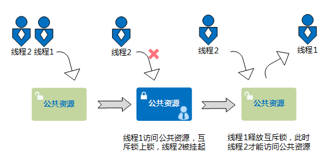

# 互斥锁

[[toc]]  

## 概述

### 基本概念

互斥锁又称互斥型信号量，是一种特殊的二值性信号量，用于实现对共享资源的独占式处理。

任意时刻互斥锁的状态只有两种，开锁或闭锁。当有任务持有时，互斥锁处于闭锁状态，这个任务获得该互斥锁的所有权。当该任务释放它时，该互斥锁被开锁，任务失去该互斥锁的所有权。当一个任务持有互斥锁时，其他任务将不能再对该互斥锁进行开锁或持有。  

多任务环境下往往存在多个任务竞争同一共享资源的应用场景，互斥锁可被用于对共享资源的保护从而实现独占式访问。另外，互斥锁可以解决信号量存在的优先级翻转问题。  

Huawei LiteOS提供的互斥锁具有如下特点：

- 通过优先级继承算法，解决优先级翻转问题。

### 运作机制  

**互斥锁运作原理**  

多任务环境下会存在多个任务访问同一公共资源的场景，而有些公共资源是非共享的，需要任务进行独占式处理。互斥锁怎样来避免这种冲突呢？   

用互斥锁处理非共享资源的同步访问时，如果有任务访问该资源，则互斥锁为加锁状态。此时其他任务如果想访问这个公共资源则会被阻塞，直到互斥锁被持有该锁的任务释放后，其他任务才能重新访问该公共资源，此时互斥锁再次上锁，如此确保同一时刻只有一个任务正在访问这个公共资源，保证了公共资源操作的完整性。  

互斥锁运作示意图  

  

## 开发指导

### 使用场景  

互斥锁可以提供任务之间的互斥机制，用来防止两个任务在同一时刻访问相同的共享资源。

### 功能  

Huawei LiteOS 系统中的互斥锁模块为用户提供下面几种功能。  

| 功能分类           | 接口名         | 描述             |
|--------------------|----------------|------------------|
| 互斥锁的创建和删除   | `LOS_MuxCreate` | 创建互斥锁      |
|                    | `LOS_MuxDelete` | 删除指定的互斥锁 |
| 互斥锁的申请和释放   | `LOS_MuxPend`   | 申请指定的互斥锁   |
|                    | `LOS_MuxPost`   | 释放指定的互斥锁 |

### 开发流程

互斥锁典型场景的开发流程：  

1.  创建互斥锁 `LOS_MuxCreate`。  

2.  申请互斥锁 `LOS_MuxPend`。  

	申请模式有三种：无阻塞模式、永久阻塞模式、定时阻塞模式。

	- 无阻塞模式：任务需要申请互斥锁，若该互斥锁当前没有任务持有，或者持有该互斥锁的任务和申请该互斥锁的任务为同一个任务，则申请成功。  

	- 永久阻塞模式：任务需要申请互斥锁，若该互斥锁当前没有被占用，则申请成功。否则，该任务进入阻塞态，系统切换到就绪任务中优先级最高者继续执行。任务进入阻塞态后，直到有其他任务释放该互斥锁，阻塞任务才会重新得以执行。  

	- 定时阻塞模式：任务需要申请互斥锁，若该互斥锁当前没有被占用，则申请成功。否则该任务进入阻塞态，系统切换到就绪任务中优先级最高者继续执行。任务进入阻塞态后，指定时间超时前有其他任务释放该互斥锁，或者用户指定时间超时后，阻塞任务才会重新得以执行。  

3.  释放互斥锁 `LOS_MuxPost`。  

	- 如果有任务阻塞于指定互斥锁，则唤醒最早被阻塞的任务，该任务进入就绪态，并进行任务调度；

	- 如果没有任务阻塞于指定互斥锁，则互斥锁释放成功。

4.  删除互斥锁 `LOS_MuxDelete`。

## 注意事项

- 两个任务不能对同一把互斥锁加锁。如果某任务对已被持有的互斥锁加锁，则该任务会被挂起，直到持有该锁的任务对互斥锁解锁，才能执行对这把互斥锁的加锁操作。

- 互斥锁不能在中断服务程序中使用。

- Huawei LiteOS作为实时操作系统需要保证任务调度的实时性，尽量避免任务的长时间阻塞，因此在获得互斥锁之后，应该尽快释放互斥锁。

- 持有互斥锁的过程中，不得再调用 `LOS_TaskPriSet` 等接口更改持有互斥锁任务的优先级。

## 编程实例

### 实例描述

本实例实现如下流程。 

1.  任务 `Example_TaskEntry` 创建一个互斥锁，锁任务调度，创建两个任务 `Example_MutexTask1`、`Example_MutexTask2`, `Example_MutexTask2` 优先级高于 `Example_MutexTask1` ，解锁任务调度。

2.  `Example_MutexTask2` 被调度，永久申请互斥锁，然后任务休眠 100Tick，`Example_MutexTask2` 挂起，`Example_MutexTask1` 被唤醒。

3.  `Example_MutexTask1` 申请互斥锁，等待时间为 10Tick，因互斥锁仍被 `Example_MutexTask2` 持有，`Example_MutexTask1` 挂起，10Tick 后未拿到互斥锁，`Example_MutexTask1` 被唤醒，试图以永久等待申请互斥锁，`Example_MutexTask1` 挂起。

4.  100Tick 后 `Example_MutexTask2` 唤醒， 释放互斥锁后，`Example_MutexTask1` 被调度运行，最后释放互斥锁。

5.  `Example_MutexTask1` 执行完，300Tick后任务 `Example_TaskEntry` 被调度运行，删除互斥锁。

### 编程示例

前提条件：

- 在 `los_config.h` 中，将 `LOSCFG_BASE_IPC_MUX` 配置项打开。

- 配好 `LOSCFG_BASE_IPC_MUX_LIMIT` 最大的互斥锁个数。

代码实现如下：

``` c 

/*互斥锁句柄ID*/
static UINT32 g_Testmux01;

/*任务PID*/
UINT32 g_TestTaskID01;
UINT32 g_TestTaskID02;

static VOID Example_MutexTask1()
{
    UINT32 uwRet;

    printf("task1 try to get mutex, wait 10 Tick.\r\n");

    /*申请互斥锁*/
    uwRet=LOS_MuxPend(g_Testmux01, 10);

    if(uwRet == LOS_OK)
    {
        printf("task1 get mutex g_Testmux01.\r\n");
        /*释放互斥锁*/
        LOS_MuxPost(g_Testmux01);
        return;
    }
    else if(uwRet == LOS_ERRNO_MUX_TIMEOUT )
    {
        printf("task1 timeout and try to get  mutex, wait forever.\r\n");
        /*LOS_WAIT_FOREVER方式申请互斥锁,获取不到时程序阻塞，不会返回*/
        uwRet = LOS_MuxPend(g_Testmux01, LOS_WAIT_FOREVER);
        if(uwRet == LOS_OK)
        {
            printf("task1 wait forever,got mutex g_Testmux01 success.\r\n");
            /*释放互斥锁*/
            LOS_MuxPost(g_Testmux01);
            uwRet = LOS_InspectStatusSetByID(LOS_INSPECT_MUTEX,LOS_INSPECT_STU_SUCCESS);
            if (LOS_OK != uwRet)  
            {
                printf("Set Inspect Status Err.\r\n");
            }
            return;
        }
    }
    return;
}

static VOID Example_MutexTask2()
{
    UINT32 uwRet;

    printf("task2 try to get mutex, wait forever.\r\n");
    /*申请互斥锁*/
    uwRet=LOS_MuxPend(g_Testmux01, LOS_WAIT_FOREVER);
    if(uwRet != LOS_OK)
    {
        printf("task2 LOS_MuxPend failed.\r\n");
        return;
    }

    printf("task2 get mutex g_Testmux01 and suspend 100 Tick.\r\n");

    /*任务休眠100 Tick*/
    LOS_TaskDelay(100);

    printf("task2 resumed and post the g_Testmux01\r\n");
    /*释放互斥锁*/
    LOS_MuxPost(g_Testmux01);
    return;
}

UINT32 Example_MutexLock(VOID)
{
    UINT32 uwRet;
    TSK_INIT_PARAM_S stTask1;
    TSK_INIT_PARAM_S stTask2;

    /*创建互斥锁*/
    LOS_MuxCreate(&g_Testmux01);

    /*锁任务调度*/
    LOS_TaskLock();

    /*创建任务1*/
    memset(&stTask1, 0, sizeof(TSK_INIT_PARAM_S));
    stTask1.pfnTaskEntry = (TSK_ENTRY_FUNC)Example_MutexTask1;
    stTask1.pcName       = "MutexTsk1";
    stTask1.uwStackSize  = LOSCFG_BASE_CORE_TSK_DEFAULT_STACK_SIZE;
    stTask1.usTaskPrio   = 5;
    uwRet = LOS_TaskCreate(&g_TestTaskID01, &stTask1);
    if(uwRet != LOS_OK)
    {
        printf("task1 create failed.\r\n");
        return LOS_NOK;
    }

    /*创建任务2*/
    memset(&stTask2, 0, sizeof(TSK_INIT_PARAM_S));
    stTask2.pfnTaskEntry = (TSK_ENTRY_FUNC)Example_MutexTask2;
    stTask2.pcName       = "MutexTsk2";
    stTask2.uwStackSize  = LOSCFG_BASE_CORE_TSK_DEFAULT_STACK_SIZE;
    stTask2.usTaskPrio   = 4;
    uwRet = LOS_TaskCreate(&g_TestTaskID02, &stTask2);
    if(uwRet != LOS_OK)
    {
        printf("task2 create failed.\r\n");
        return LOS_NOK;
    }

    /*解锁任务调度*/
    LOS_TaskUnlock();
    /*任务休眠300 Tick*/
    LOS_TaskDelay(300);

    /*删除互斥锁*/
    LOS_MuxDelete(g_Testmux01);

    return LOS_OK;
}   
```  

### 结果验证

编译运行得到的结果为：  
  
