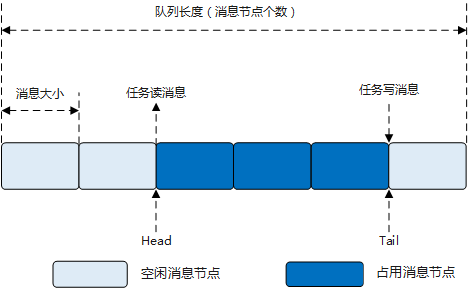
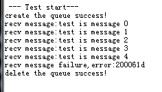

# 队列

[[toc]]  

## 概述

### 基本概念

队列又称消息队列，是一种常用于任务间通信的数据结构，实现了接收来自任务或中断的不固定长度的消息，并根据不同的接口选择传递消息是否存放在自己空间。任务能够从队列里面读取消息，当队列中的消息是空时，挂起读取任务；当队列中有新消息时，挂起的读取任务被唤醒并处理新消息。  

用户在处理业务时，消息队列提供了异步处理机制，允许将一个消息放入队列，但并不立即处理它，同时队列还能起到缓冲消息作用。  

Huawei LiteOS中使用队列数据结构实现任务异步通信工作，具有如下特性：  

- 消息以先进先出方式排队，支持异步读写工作方式。  

- 读队列和写队列都支持超时机制。  

- 发送消息类型由通信双方约定，可以允许不同长度（不超过队列节点最大值）消息。  

- 一个任务能够从任意一个消息队列接收和发送消息。  

- 多个任务能够从同一个消息队列接收和发送消息。  

- 当队列使用结束后，如果是动态申请的内存，需要通过释放内存函数回收。  

### 运作机制

#### 队列控制块

```c
typedef struct tagQueueCB
{
    UINT8       *pucQueue;      /**< 队列指针 */
    UINT16      usQueueState;   /**< 队列状态 */
    UINT16      usQueueLen;     /**< 队列中消息个数 */
    UINT16      usQueueSize;    /**< 消息节点大小 */
    UNIT16      usQueueID;      /**< 队列ID号 */
    UINT16      usQueueHead;    /**< 消息头节点位置（数组下标）*/
    UINT16      usQueueTail;    /**< 消息尾节点位置（数组下标）*/
    UINT16      usReadWritableCnt[2];  /**< 队列中可写或可读消息数，0表示可读，1表示可写*/
    LOS_DL_LIST stReadWriteableList[2];    /**< 读写阻塞队列，0表示读阻塞队列，1表示写阻塞队列*/
    LOS_DL_LIST stMemList;      /**< MailBox模块使用 */
} QUEUE_CB_S;  
```

每个队列控制块中都含有队列状态，表示该队列的使用情况：  

- `OS_QUEUE_UNUSED`：队列没有使用

- `OS_QUEUE_INUSED`：队列被使用

### 队列运作原理

创建队列时，根据用户传入队列长度和消息节点大小来开辟相应的内存空间以供该队列使用，返回队列 ID。  

在队列控制块中维护一个消息头节点位置 Head 和一个消息尾节点位置 Tail 来表示当前队列中消息存储情况。Head 表示队列中被占用消息的起始位置。 Tail 表示队列中被空闲消息的起始位置。刚创建时 Head 和 Tail 均指向队列起始位置。  

写队列时，根据 Tail 找到被占用消息节点末尾的空闲节点作为数据写入对象。如果 Tail 已经指向队列尾则采用回卷方式。根据 usWritableCnt 判断队列是否可以写入，不能对已满（usWritableCnt为0）队列进行写队列操作。  

读队列时，根据Head找到最先写入队列中的消息节点进行读取。如果Head已经指向队列尾则采用回卷方式。根据usReadableCnt判断队列是否有消息读取，对全部空闲（usReadableCnt为0）队列进行读队列操作会引起任务挂起。  

删除队列时，根据传入的队列 ID 寻找到对应的队列，把队列状态置为未使用，释放原队列所占的空间，对应的队列控制头置为初始状态。  

队列读写数据操作示意图  
  

## 开发指导

### 功能

Huawei LiteOS中Message消息处理模块提供了以下功能。  

| 功能分类           | 接口名              | 描述                                                     |
|--------------------|---------------------|----------------------------------------------------------|
| 创建消息队列       | `LOS_QueueCreate`    | 创建一个消息队列                                         |
| 读队列（不带拷贝） | `LOS_QueueRead`      | 读取指定队列中的数据。（buff里存放的是队列节点的地址）       |
| 写队列（不带拷贝） | `LOS_QueueWrite`     | 向指定队列写数据。（写入队列节点中的是buff的地址）           |
| 读队列（带拷贝）   | `LOS_QueueReadCopy`  | 读取指定队列中的数据。（buff里存放的是队列节点中的数据）     |
| 写队列（带拷贝）   | `LOS_QueueWriteCopy` | 向指定队列写数据。（写入队列节点中的是buff中的数据）         |
| 写队列（头部）     | `LOS_QueueWriteHead` | 向指定队列的头部写数据                                    |
| 删除队列           | `LOS_QueueDelete`    | 删除一个指定的队列                                       |
| 获取队列信息       | `LOS_QueueInfoGet`   | 获取指定队列信息                                         |

### 开发流程  使用队列模块的典型流程如下：

1.  创建消息队列 `LOS_QueueCreate`。

	创建成功后，可以得到消息队列的 ID 值。

2.  写队列操作函数 `LOS_QueueWrite`。

3.  读队列操作函数 `LOS_QueueRead`。

4.  获取队列信息函数 `LOS_QueueInfoGet`。

5.  删除队列 `LOS_QueueDelete`。

## 注意事项

- 系统可配置的队列资源个数是指：整个系统的队列资源总个数，而非用户能使用的个数。例如：系统软件定时器多占用一个队列资源，那么系统可配置的队列资源就会减少一个。

- 调用 `LOS_QueueCreate` 函数时所传入的队列名暂时未使用，作为以后的预留参数。

- 队列接口函数中的入参 uwTimeOut 是指相对时间。

- `LOS_QueueReadCopy` 和 `LOS_QueueWriteCopy` 是一组接口，`LOS_QueueRead` 和 `LOS_QueueWrite` 是一组接口，两组接口需要配套使用。

- 鉴于 `LOS_QueueWrite` 和 `LOS_QueueRead` 这组接口实际操作的是数据地址，用户必须保证调用 `LOS_QueueRead` 获取到的指针所指向内存区域在读队列期间没有被异常修改或释放，否则可能会导致不可预知的后果。

## 编程实例

### 实例描述

创建一个队列，两个任务。任务1调用发送接口发送消息；任务2通过接收接口接收消息。  

1.  通过 `LOS_TaskCreate` 创建任务1和任务2。  

2.  通过 `LOS_QueueCreate` 创建一个消息队列。  
  
3.  在任务1 `send_Entry` 中发送消息。  
 
4.  在任务2 `recv_Entry` 中接收消息。  

5.  通过 `LOS_QueueDelete` 删除队列。

### 编程示例

```c
#include "los_base.h"
#include "los_task.h"
#include "los_swtmr.h"
#include "los_hwi.h"
#include "los_queue.h"
#include "los_event.h"
#include "los_typedef.h"
#include "los_api_msgqueue.h"
#include "los_inspect_entry.h"

static UINT32 g_uwQueue;
static CHAR abuf[] = "test is message x";

/*任务1发送数据*/
static void *send_Entry(UINT32 uwParam1,
                UINT32 uwParam2,
                UINT32 uwParam3,
                UINT32 uwParam4)
{
    UINT32 i = 0,uwRet = 0;
    UINT32 uwlen = sizeof(abuf);

    while (i < API_MSG_NUM)
    {
        abuf[uwlen -2] = '0' + i;
        i++;

        /*将abuf里的数据写入队列*/
        uwRet = LOS_QueueWrite(g_uwQueue, abuf, uwlen, 0);
        if(uwRet != LOS_OK)
        {
            dprintf("send message failure,error:%x\n",uwRet);
        }

        LOS_TaskDelay(5);
    }
    return NULL;
}

/*任务2接收数据*/
static void *recv_Entry(UINT32 uwParam1,
                UINT32 uwParam2,
                UINT32 uwParam3,
                UINT32 uwParam4)
{
    UINT32 uwReadbuf;
    UINT32 uwRet = LOS_OK;
    UINT32 uwMsgCount = 0;

    while (1)
    {

        /*读取队列里的数据存入uwReadbuf里*/
        uwRet = LOS_QueueRead(g_uwQueue, &uwReadbuf, 24, 0);
        if(uwRet != LOS_OK)
        {
            dprintf("recv message failure,error:%x\n",uwRet);
            break;
        }
        else
        {
            dprintf("recv message:%s\n", (char *)uwReadbuf);
            uwMsgCount++;
        }
        
        (void)LOS_TaskDelay(5);
    }
    /*删除队列*/
    while (LOS_OK != LOS_QueueDelete(g_uwQueue))
    {
        (void)LOS_TaskDelay(1);
    }
        
    dprintf("delete the queue success!\n");
        
    if(API_MSG_NUM == uwMsgCount)
    {
        uwRet = LOS_InspectStatusSetByID(LOS_INSPECT_MSG,LOS_INSPECT_STU_SUCCESS);
        if (LOS_OK != uwRet)  
        {
            dprintf("Set Inspect Status Err\n");
        }
    }
    else
    {
        uwRet = LOS_InspectStatusSetByID(LOS_INSPECT_MSG,LOS_INSPECT_STU_ERROR);
        if (LOS_OK != uwRet)  
        {
            dprintf("Set Inspect Status Err\n");
        }
    }
        
    return NULL;
}

UINT32 Example_MsgQueue(void)
{
    UINT32 uwRet = 0;
    UINT32 uwTask1, uwTask2;
    TSK_INIT_PARAM_S stInitParam1;

    /*创建任务1*/
    stInitParam1.pfnTaskEntry = send_Entry;
    stInitParam1.usTaskPrio = 9;
    stInitParam1.uwStackSize = LOSCFG_BASE_CORE_TSK_DEFAULT_STACK_SIZE;
    stInitParam1.pcName = "sendQueue";
    LOS_TaskLock();//锁住任务，防止新创建的任务比本任务高而发生调度
    uwRet = LOS_TaskCreate(&uwTask1, &stInitParam1);
    if(uwRet != LOS_OK)
    {
        dprintf("create task1 failed!,error:%x\n",uwRet);
        return uwRet;
    }

    /*创建任务2*/
    stInitParam1.pfnTaskEntry = recv_Entry;
    uwRet = LOS_TaskCreate(&uwTask2, &stInitParam1);
    if(uwRet != LOS_OK)
    {
        dprintf("create task2 failed!,error:%x\n",uwRet);
        return uwRet;
    }

    /*创建队列*/
    uwRet = LOS_QueueCreate("queue", 5, &g_uwQueue, 0, 24);
    if(uwRet != LOS_OK)
    {
        dprintf("create queue failure!,error:%x\n",uwRet);
    }

    dprintf("create the queue success!\n");
    LOS_TaskUnlock();//解锁任务，只有队列创建后才开始任务调度
    
    return LOS_OK;
}  
```

### 结果验证

