# STM32Cube 构建裸机工程

最近几年 ST 官方都在大力推行 STM32CubeMX 图形化开发，鼓励大家从标准库转到 HAL 库上来。随着 STM32Cube 快速迭代更新，目前已经支持 STM32 全系列产品，配置和使用都非常方便。因此我们在本教程中用 STM32Cube 作为裸机工程的构建工具，一步步指导开发者完成 Huawei LiteOS 的内核移植。

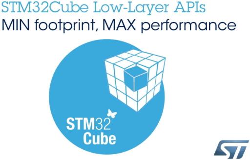

## 安装 STM32Cube 并下载芯片对应的软件支持包

STM32Cube 是 ST 提供的一套性能强大的免费开发工具和嵌入式软件模块，能够让开发人员在 STM32 平台上快速、轻松地开发应用。它包含两个关键部分：

- **图形配置工具**（STM32CubeMX）—— 允许用户通过图形化向导来生成 C 语言工程。
- **嵌入式软件包**（STM32Cube 库）—— 包含完整的 HAL 库（STM32 硬件抽象层 API），配套的中间件（包括 RTOS，USB，TCP/IP 和图形），以及一系列完整的例程。

### 你应当知道的事

ST 先后提供了两套固件库：**标准库** 和 **HAL 库**。STM32 芯片面市之初只提供了丰富全面的标准库，大大方便了用户程序开发，为广大开发板所推荐。目前网络学习资料和源码，绝大多数都是采用的标准库。

大约到 2014 年左右，ST 在标准库的基础上又推出了 HAL 库。实际上，HAL 库和标准库本质上是一样的，都是提供底层硬件操作 API，而且在使用上也大同小异。最近两年新出的 STM32 芯片，ST 甚至只提供 HAL 库。我们即将使用的 STM32Cube 工具生成的项目也只包含 HAL 库。

本教程读者会有相当一部分都有过基于标准库的开发经验，对于使用 HAL 库可能会存在排斥。说老实话，大家不必纠结到底是学习 HAL 库还是标准库，无论使用哪种库，只要理解了 STM32 本质，任何库都是一种工具，使用起来都非常方便。

::: tip 提示
我们不会花大量篇幅来介绍 STM32 和 HAL 库的使用，其相关知识的学习还需要大家去参考更专业的教程。对于 STM32Cube 工具的使用，我们也尽量做到点到为止。
:::

### 下载并安装 STM32Cube

1. 由于 STM32CubeMX 依赖 Java 运行环境，如果您的电脑上没有 Java 1.7 以上的运行环境，请先到 [这里](http://www.oracle.com/technetwork/java/javase/downloads/jre8-downloads-2133155.html) 下载到最新版本 JRE。

2. STM32Cube 则可以在 ST 官网 [https://www.st.com/stm32cube](https://www.st.com/en/development-tools/stm32cubemx.html) 免费下载；

::: warning 警告
由于 STM32CubeMX 软件版本更新非常频繁，其新版本创建的工程无法被旧版本软件打开，我们这里就不提供网盘下载，建议大家尽量下载最新版本。
:::

3. 我们这里以 MDK5.25 作为开发环境，请提前下载并安装。

总的来说，STM32Cube 安装起来相当简单，只需要一路 `Next` 即可完成安装。

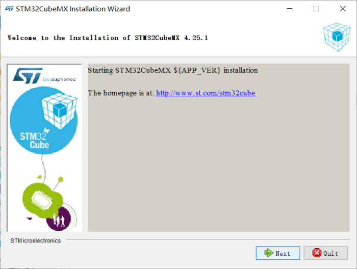

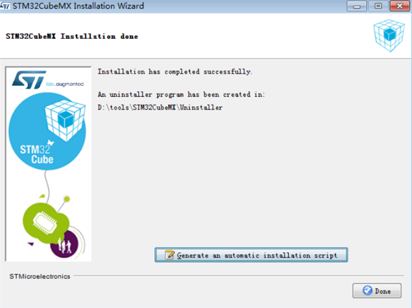

接下来我们先启动 STM32CubeMX，看看如何创建一个 STM32Cube工程。

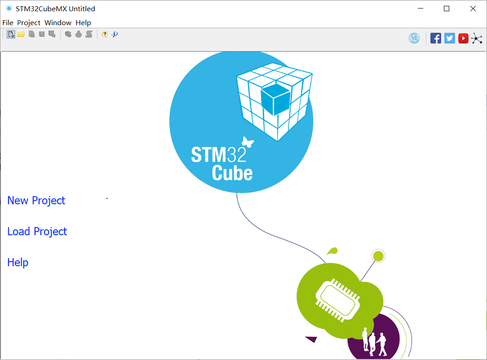

在创建工程之前，还需要先安装开发板 MCU 芯片对应的软件包，如下图所示，点击 `Help` ->  `Manage embedded software packages`，打开软件包管理界面。

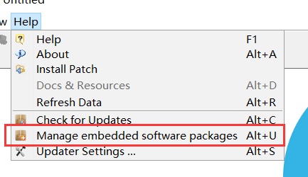

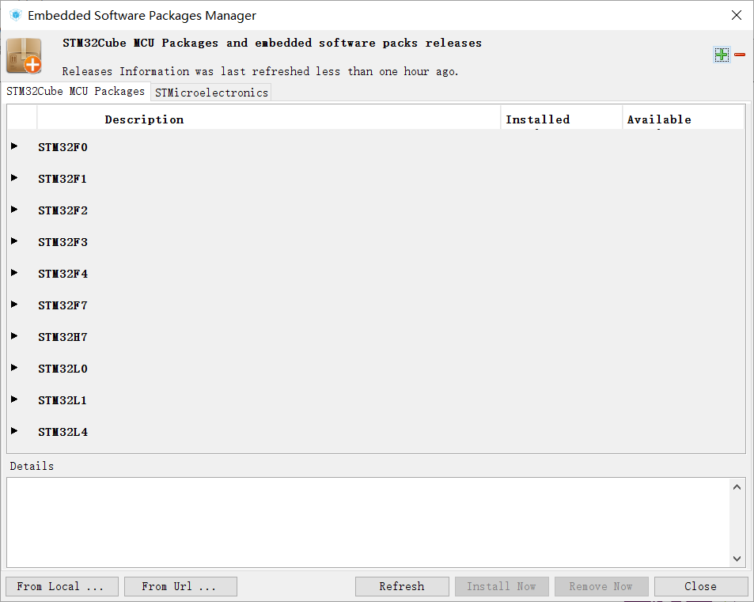

目前有 **离线** 和 **在线** 两种方式进行安装：

**1. 离线安装**

需要访问 [https://www.st.com/stm32cube](https://www.st.com/en/development-tools/stm32cubemx.html) 下载对应的离线软件包，然后点击 `From Local ...`，选取对应的离线软件包即可完成。

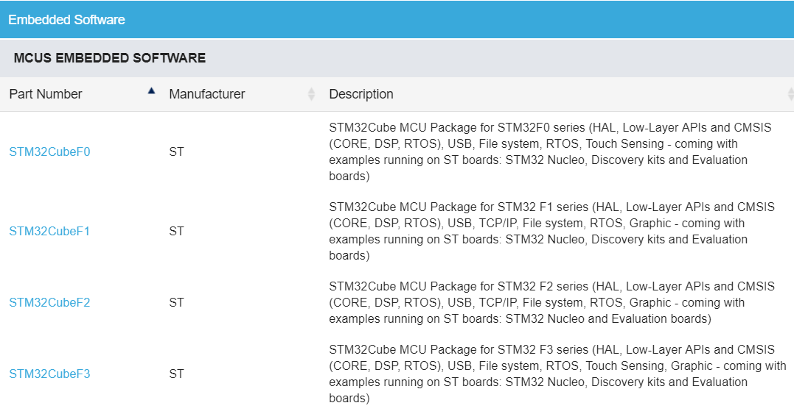

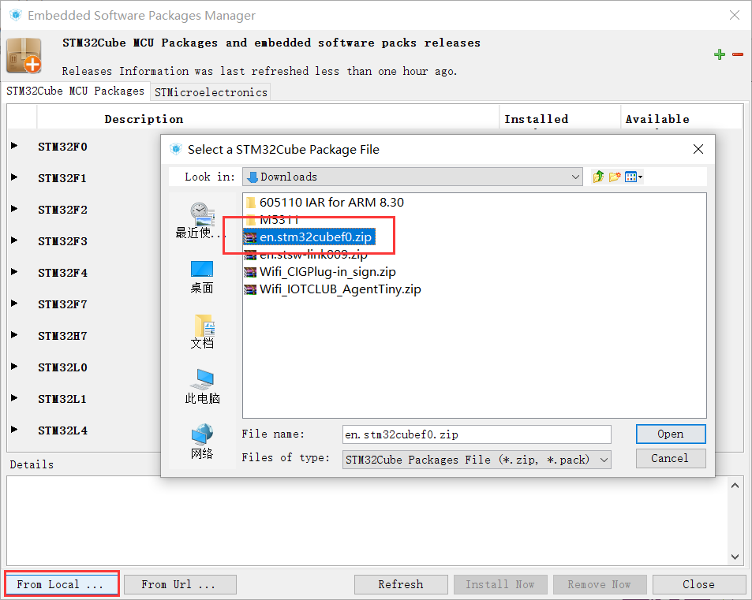

**2. 在线安装**

如果您的网络很稳定，也可以直接选取需要移植的开发板 MCU 对应的芯片系列，点击 `Install Now`。STM32CubeMX 会自动下载对应的软件包并完成安装。

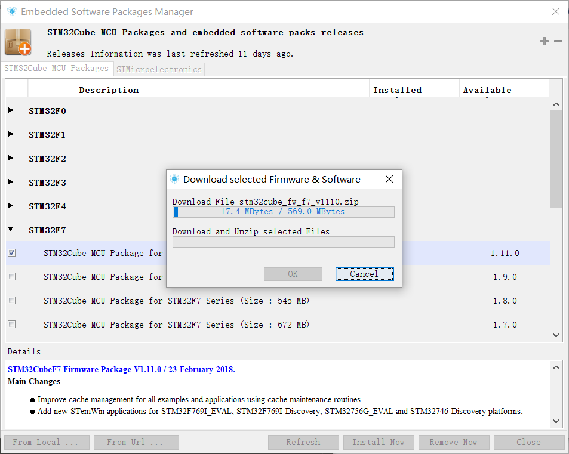

## 使用 STM32CubeMX 创建适配开发板的裸机工程

要移植 OS，肯定需要一个基础工程，基础工程则是越简单越好。下面我们一步步创建裸机工程。

### 新建工程

1. 根据你开发板使用的 CPU 型号来选择，我们这里输入 `STM32F103ZE`，选择具体型号（封装不同）。

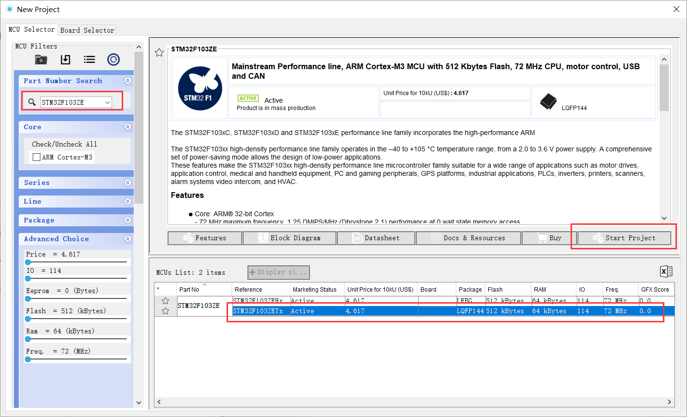

2. 进入工程后打开 RCC 选项，使能 High Speed Clock (HSE) `Crystal/Ceramic Resonator`，即使用外部晶振作为 HSE 的时钟源。

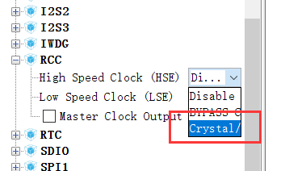

3. 使能 UART1，选择 `Asynchronous`。

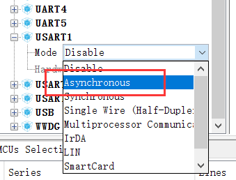

4. 从开发板原理图，配置 2 个 LED ，分别对应 **PB5** 和 **PE5** IO。

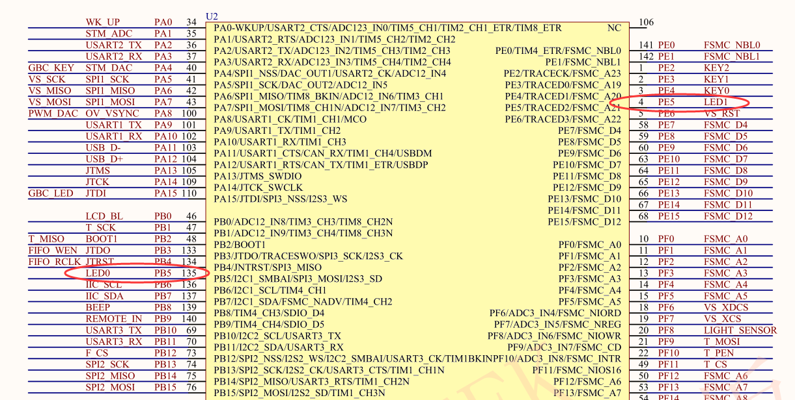

::: warning 警告
如果大家正在操作的开发板并不是正点原子的战舰V3，那么对应的 LED IO 很大可能不是 PB5 和 PE5。这需要大家对照的开发板原理图，查找对应的 LED IO。

通常开发板会预留 2 个以上 LED，为了我们后续验证实验顺利进行，建议启用 2 个 LED IO。
:::

找到对应的 IO 后，则将其设置为 `GPIO_Output`，然后右键选择 `Enter user label` 为 `PB5` 命名为 `LED0`

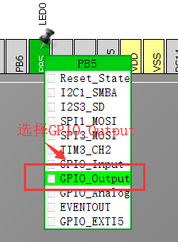

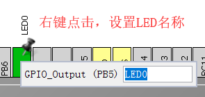

同样的方法将 `PE5` 配置好，并命名为 `LED1`。

最终配置完成效果如下：

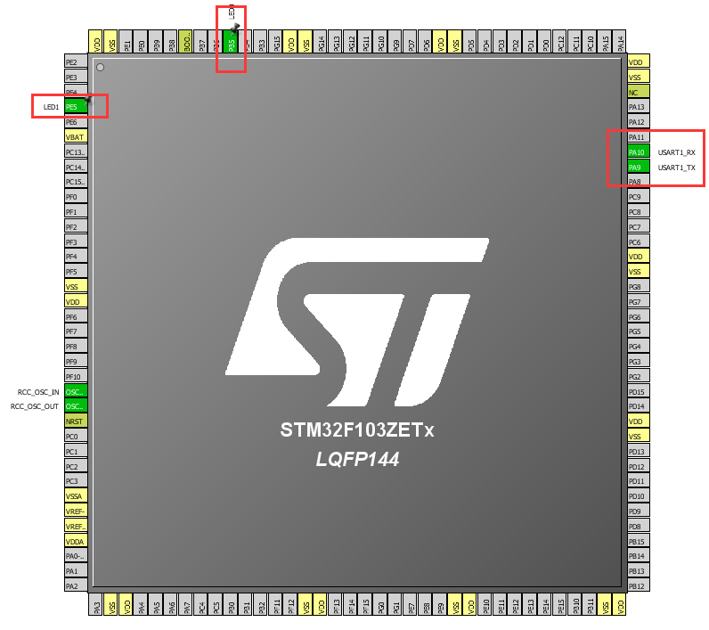

::: tip 提示
由于 STM32CubeMX 默认配置就可以让裸机工程正常工作，我们这里不想介绍得过多。

如果读者需要对 **时钟**，**串口**，**GPIO** 等外设进行进一步配置，可以参考下图进行修改。
:::

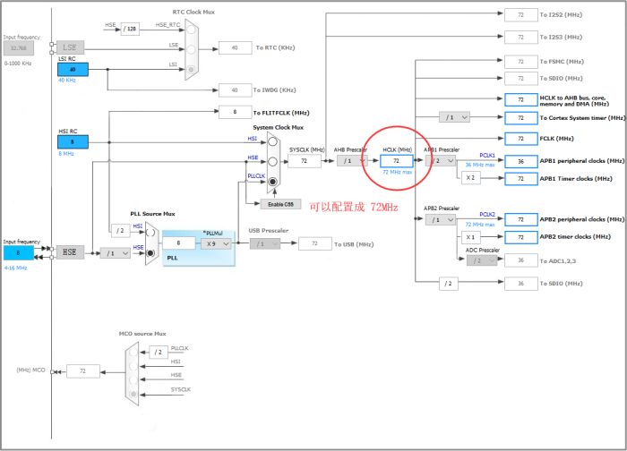

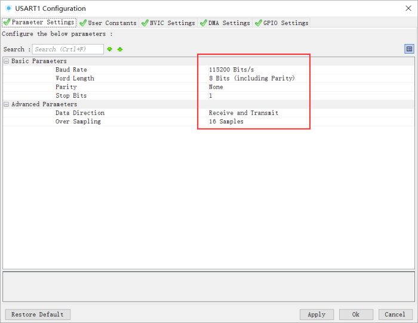

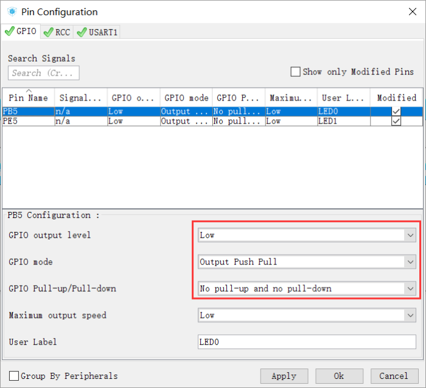

### 配置工程属性，生成代码

我们已经支持 [MDK-ARM](stm32-keil.md)，[IAR EWARM](stm32-iar.md)，[SW4STM32](stm32-sw4stm32.md) 和 [Makefile/GCC](stm32-makefile.md) 四种工具链/IDE 作为 LiteOS 开发环境，如下图所示选出您熟悉的工具链，配置好工程名和代码导出路径即可。

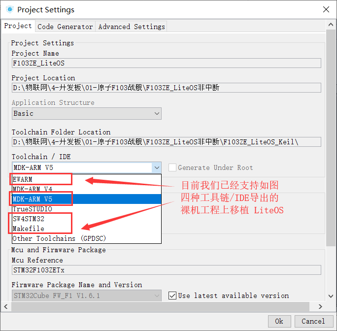

为便于外设相关代码维护，建议将下面的选项勾中。

最后选择菜单栏上 `Project` -> `Generate Code` 或点击下图齿轮按钮，STM32Cube 会自动导出裸机工程。

为了让导出的裸机工程适配 LiteOS 目录树结构，可直接将工程放置在 `\LiteOS\target` 目录中。

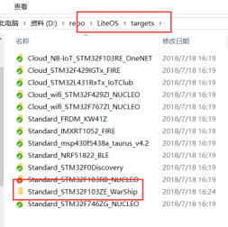

考虑到绝大多数情况，初学者希望能 **从零开始** 构建 LiteOS 编译工程，也可以按照下图所示将工程导出到独立目录。（后面的具体移植步骤我们都会基于从零开始在独立目录下完成 LiteOS 移植）

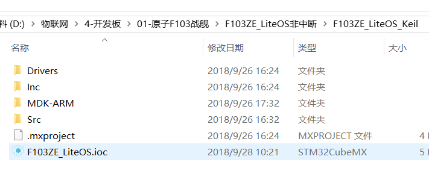

至此，裸机工程就成功创建了。
