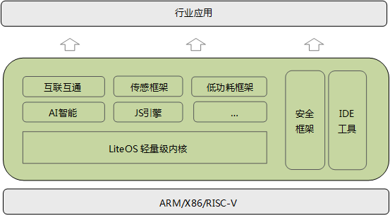
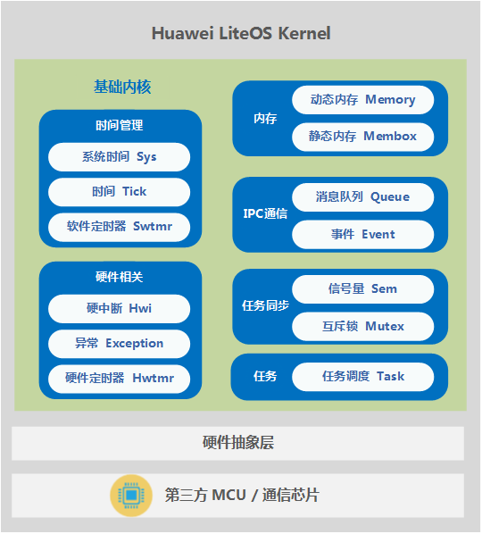
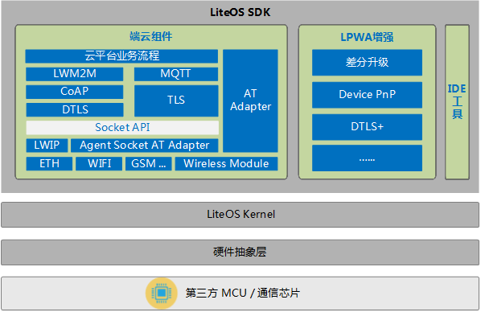

# LiteOS 介绍

## 主要功能

Huawei LiteOS 是华为面向IoT领域，构建的轻量级物联网操作系统，遵循BSD-3开源许可协议，可广泛应用于智能家居、个人穿戴、车联网、城市公共服务、制造业等领域，大幅降低设备布置及维护成本，有效降低开发门槛、缩短开发周期。

2015 年 5 月 20 日，在 2015 华为网络大会上，华为发布最轻量级的 **物联网操作系统 LiteOS**。

## 支持的硬件

LiteOS开源项目目前支持 ARM Cortex-M0，Cortex-M3，Cortex-M4，Cortex-M7 等芯片架构

[LiteOS支持的开发板列表](https://github.com/LiteOS/LiteOS/blob/master/doc/LiteOS_Supported_board_list.md)

Huawei LiteOS 联合业界主流MCU厂家，通过开发者活动，目前已经适配了30+ 通用 MCU开发套件，5套NB-IoT集成开发套件

## 开源协议

遵循 BSD-3 开源许可协议

[Huawei LiteOS 知识产权政策](http://developer.huawei.com/ict/cn/site-iot/article/iot-intellectual-property-rights)

### 文档修改

如果您发现文档有错误、遗漏，或者描述不够准备，您可以通过点击页面尾部 “在 GitHub 上编辑此页”，对相关内容进行编辑，感谢您的参与和贡献

## LiteOS 内核

LiteOS Kernel是Huawei LiteOS 操作系统基础内核，包括**任务管理、内存管理、时间管理、通信机制、中断管理、队列管理、事件管理、定时器**等操作系统基础组件，可以单独运行。

- 高实时性，高稳定性

- 超小内核，基础内核体积可以裁剪至不到10K

- 低功耗

- 支持功能静态裁剪

## LiteOS SDK

LiteOS SDK 是 Huawei LiteOS 软件开发工具包（Software Development Kit），包括端云互通组件，FOTA，JS引擎、传感器框架等内容。

## 加入我们

如您有合作意向，希望加入 Huawei LiteOS 生态合作伙伴，请发邮件至 [liteos@huawei.com](mailto:liteos@huawei.com)，或访问[LiteOS官网](http://www.huawei.com/liteos)，进一步了解详细信息
