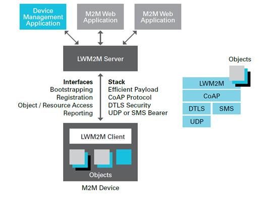
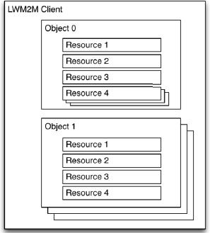
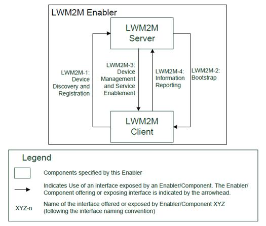
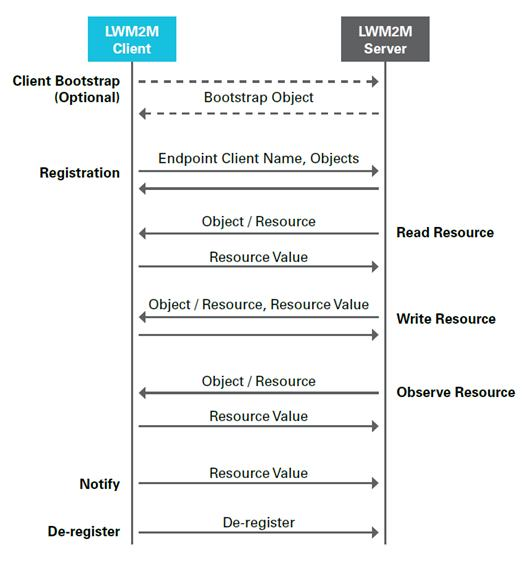
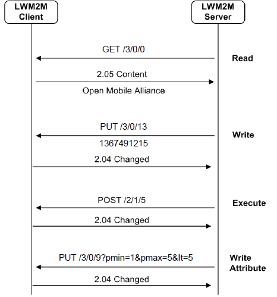
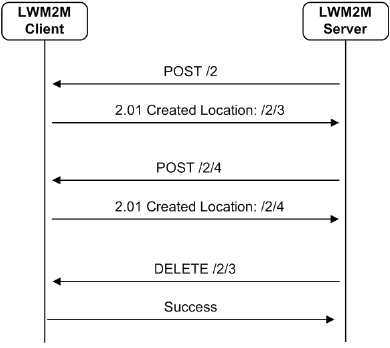
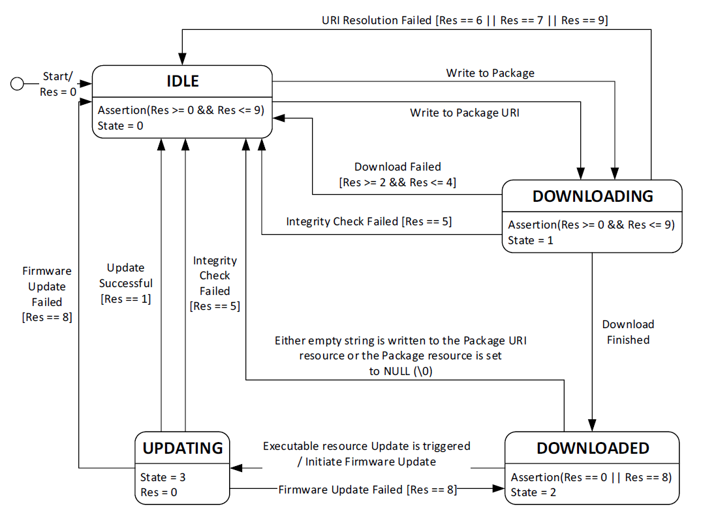
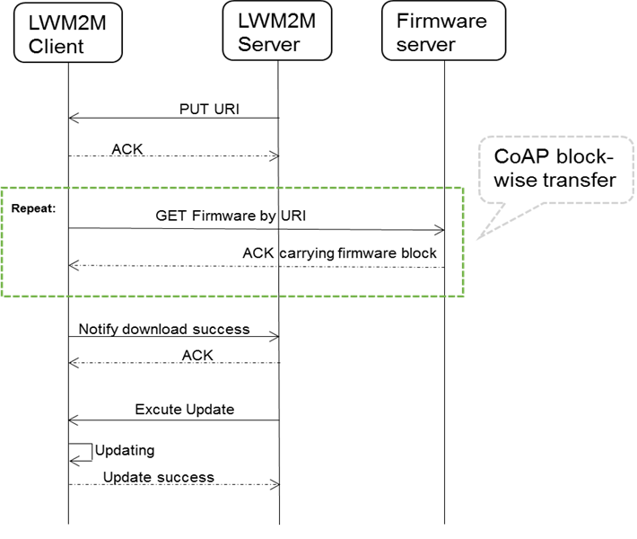

# 附录 LwM2M 协议介绍

## LwM2M 协议是什么

LwM2M（Lightweight
M2M，轻量级M2M），由开发移动联盟（OMA）提出，是一种轻量级的、标准通用的物联网设备管理协议，可用于快速部署客户端/服务器模式的物联网业务。

LwM2M为物联网设备的管理和应用建立了一套标准，它提供了轻便小巧的安全通信接口及高效的数据模型，以实现M2M设备管理和服务支持。

## LwM2M 协议特性

LwM2M协议主要特性包括：

* 基于资源模型的简单对象

* 资源操作：创建/检索/更新/删除/属性配置

* 资源的观察/通知

* 支持的数据格式：TLV/JSON/Plain Text/Opaque

* 传输层协议：UDP/SMS

* 安全协议：DTLS

* NAT/防火墙应对方案: Queue模式

* 支持多LwM2M Server

* 基本的M2M功能：LwM2MServer，访问控制，设备，网络连接监测，固件更新，位置和定位服务，统计

## LwM2M 体系架构

LwM2M体系架构如图所示：

**LwM2M 体系架构**

## LwM2M 对象定义

* 对象概念

对象是逻辑上用于特定目的的一组资源的集合。例如固件更新对象，它就包含了用于固件更新目的的所有资源，例如固件包、固件URL、执行更新、更新结果等。

使用对象的功能之前，必须对该对象进行实例化，对象可以有多个对象实例，对象实例的编号从0开始递增。

OMA定义了一些标准对象，LwM2M协议为这些对象及其资源已经定义了固定的ID。例如：固件更新对象的对象ID为5，该对象内部有8个资源，资源ID分别为0\~7，其中“固件包名字”这个资源的ID为6。因此，URI
5/0/6表示：固件更新对象第0个实例的固件包名字这个资源。

* 对象定义的格式

| Name        | Object ID               | Instances        | Mandatory          | Object URN                            |
|-------------|-------------------------|------------------|--------------------|---------------------------------------|
| Object Name | 16-bit Unsigned Integer | Multiple/ Single | Mandatory/Optional | urn:oma:LwM2M:{oma,ext,x}:{Object ID} |

* OMA定义的标准对象

OMA的LwM2M规范中定义了7个标准对象：

| Object                  | object id | description                                                                           |
|-------------------------|-----------|---------------------------------------------------------------------------------------|
| LwM2M Security          | 0         | LwM2M (bootstrap) server的URI，payload的安全模式，一些算法/密钥，server的短ID等信息。 |
| LwM2M Server            | 1         | server的短ID，注册的生命周期，observe的最小/最大周期， 绑定模型等。                   |
| Access Control          | 2         | 每个Object的访问控制权限。                                                            |
| Device                  | 3         | 设备的制造商，型号，序列号，电量，内存等信息。                                        |
| Connectivity Monitoring | 4         | 网络制式，链路质量，IP地址等信息。                                                    |
| Firmware                | 5         | 固件包，包的URI，状态，更新结果等。                                                   |
| Location                | 6         | 经纬度，海拔，时间戳等。                                                              |
| Connectivity Statistics | 7         | 收集期间的收发数据量，包大小等信息。                                                  |

LiteOS SDK端云互通组件配合Huawei Ocean
Connect物联网开发平台能力，还支持的19号LwM2M APPDATA对象：

| Object        | object id | description                                                   |
|---------------|-----------|---------------------------------------------------------------|
| LwM2M APPDATA | 19        | 此LwM2M对象提供LWM2M 服务器相关的应用业务数据，例如水表数据。 |

OMA组织定义的其它常用对象，详见<http://www.openmobilealliance.org/wp/OMNA/LwM2M/LwM2MRegistry.html>。

## LwM2M 资源定义

* 资源模型

LwM2M定义了一个资源模型，所有信息都可以抽象为资源以提供访问。资源是对象的内在组成，隶属于对象，LwM2M客户端可以拥有任意数量的资源。和对象一样，资源也可以有多个实例。

LwM2M客户端、对象以及资源的关系如图所示：

**LwM2M 客户端、对象、资源关系图**

* 资源定义的格式

| ID | Name          | Operations                       | Instance         | Mandator           | Type                                                       | Range or Enumeratio | Units  | Description |
|----|---------------|----------------------------------|------------------|--------------------|------------------------------------------------------------|---------------------|--------|-------------|
| 0  | Resource Name | R (Read), W (Write), E (Execute) | Multiple/ Single | Mandatory/Optional | String, Integer, Float, Boolean, Opaque, Time, Objlnk none | If any              | If any | Description |

## LwM2M 接口定义

* 概述

LwM2M引擎主要有两个组件：LwM2M服务器和LwM2M客户端。LwM2M标准为两个组件之间的交互设计了4种主要的接口：

1 设备发现和注册

2 引导程序

3 设备管理和服务实现

4 信息上报

* 接口模型图

LwM2M接口模型如图所示：

**LwM2M 接口模型**

* 消息流程示例

LwM2M的消息交互流程如图所示：

**LwM2M 消息流程**

* 设备管理和服务实现接口

LwM2M的接口表示一类功能，**设备管理和服务实现**接口是LwM2M的四种接口之一。

接口的具体功能是由一系列的操作来实现的，LwM2M的4种接口被分为上行操作和下行操作。

1 上行操作：LwM2M Client -\> LwM2M Server

2 下行操作：LwM2M Server -\> LwM2M Client

LwM2M Server使用**设备管理和服务实现**接口来访问LwM2M
Client的对象实例和资源。该接口包括7种操作：“Create”、“Read”、“Write”、“Delete”、“Execute”、“Write
Attributes”和“Discover”:

**设备管理和服务实现接口操作**

| 接口               | 操作                                                             | 方向 |
|--------------------|------------------------------------------------------------------|------|
| 设备管理和服务实现 | Create，Read，Write，Delete，Execute，Write Attributes，Discover | 下行 |

**设备管理和服务实现**接口的交互过程如图所示：

**设备管理&服务使能接口示例**

**对象创建和删除示例**

## 固件升级

LwM2M的固件升级对象使得固件升级的管理成为可能。固件升级对象包括安装固件包、更新固件、以及更新固件之后执行的其它动作。成功进行了固件升级后，device必须要重启，以使新的固件生效。

在设备重启之后，如果“Packet”资源包含了一个合法的但还未被安装的固件包，“State”资源必须为\<Downloaded\>状态，
否则须为\<Idle\>状态。

在设备重启之前，标识更新结果的相关数值必须保存。

* 固件升级对象定义

| Name            | Object ID | Instances | Mandatory | Object URN         |
|-----------------|-----------|-----------|-----------|--------------------|
| Firmware Update | 5         | Single    | Optional  | rn:oma:LwM2M:oma:5 |

* 固件升级对象的资源定义

| **ID** | Name                     | Operations | Instances | Mandatory | Type    | Range or Enumeration |               Description                                                                                                                                                                                                                                                                                     |
|--------|--------------------------|------------|-----------|-----------|---------|----------------------|-------------------------------------------------------------------------------------------------------------------------------------------------------------------------------------------------------------------------------------------------------------------------------------------------|
| 0      | Package                  | W          | Single    | Mandatory | Opaque  |                      | 固件包。                                                                                                                                                                                                                                                                                        |
| 1      | Package URI              | W          | Single    | Mandatory | String  | 0-255 bytes          | 固件包的下载URI。                                                                                                                                                                                                                                                                               |
| 2      | Update                   | E          | Single    | Mandatory | none    | no argument          | 更新固件。 只有当State资源是Downloaded状态时，该资源才是可执行的。                                                                                                                                                                                                                              |
| 3      | State                    | R          | Single    | Mandatory | Integer | 0-3                  | 固件升级的状态。这个值由客户端设置。0: Idle (下载之前或者成功更新之后) 1: Downloading (下载中) 2: Downloaded (下载已完成) 3: Updating (更新中)在Downloaded状态下，如果执行Resource Update操作，状态则切换为Updating。 如果更新成功，状态切换为Idle；如果更新失败，状态切换回Downloaded。        |
| 4      | Update Supported Objects | RW         | Single    | Optional  | Boolean |                      | 默认值是false。 如果该值置为true，则固件成功更新了之后，客户端必须通过更新消息或注册消息，向服务器通知Object的变动。 如果更新失败了，Object参数通过下一阶段的更新消息报告。                                                                                                                     |
| 5      | Update Result            | R          | Single    | Mandatory | Integer | 0-8                  | 下载/更新固件的结果： 0: 初始值。一旦开始更新流程（下载/更新）开始，该资源的值必须被置为0。 1: 固件升级成功 2: 没有足够空间存储新固件包 3: 下载过程中内存不足 4: 下载过程中连接丢失 5: 新下载的包完整性检查失败 6: 不支持的包类型 7: 不合法的URI 8: 固件升级失败该资源可以通过Observe操作上报。 |
| 6      | PkgName                  | R          | Single    | Optional  | String  | 0-255 bytes          | 固件包的名字。                                                                                                                                                                                                                                                                                  |
| 7      | PkgVersion               | R          | Single    | Optional  | String  | 0-255 bytes          | 固件包的版本。                                                                                                                                                                                                                                                                                  |

* 固件升级状态机

固件升级状态之间的变换关系如图所示：

**固件升级状态图**

* 固件升级流程

固件升级流程如图所示：

**固件升级流程**

