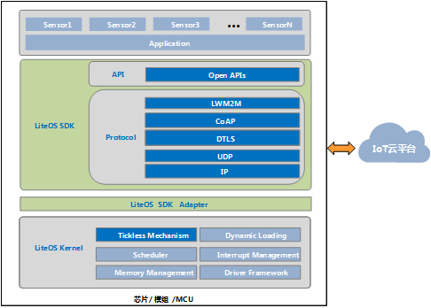
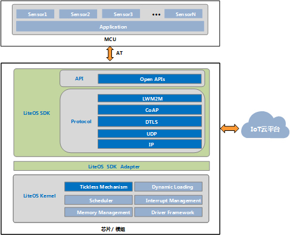
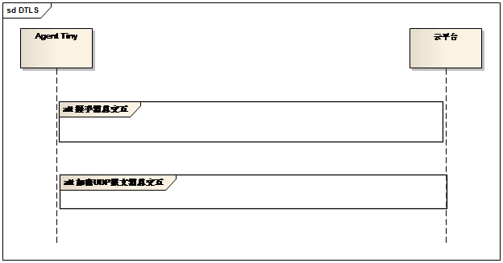
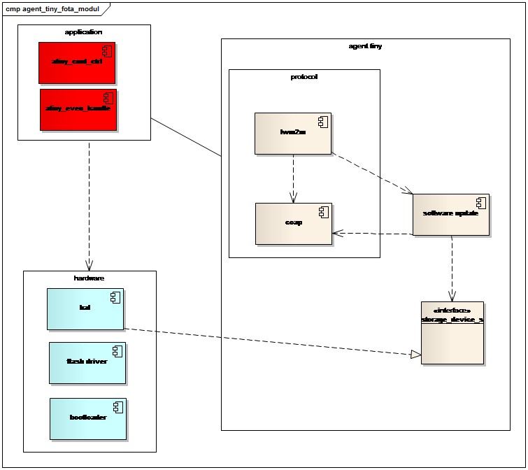
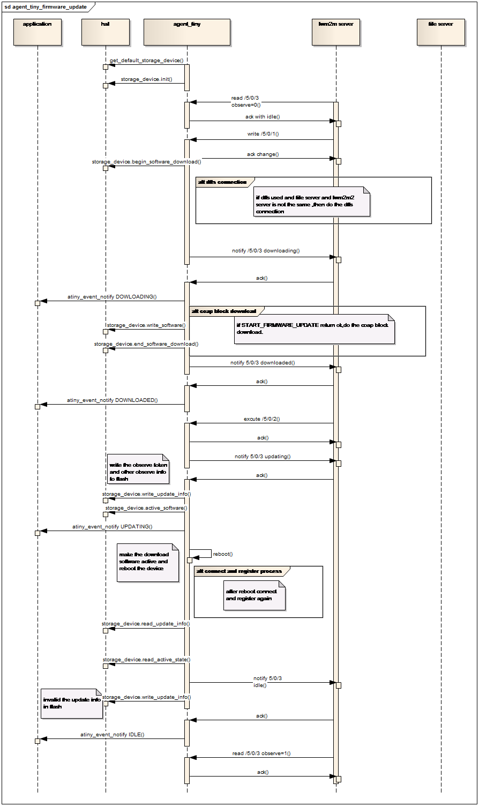

# LiteOS SDK端云互通组件介绍

## 系统方案

Huawei LiteOS
SDK端云互通组件针对单模组、单MCU和外置MCU+模组两种应用场景，提供了不同的软件架构：

**单模组/单MCU软件架构**



**MCU+芯片/模组软件架构**



LiteOS SDK 端云互通组件软件主要由三个层次构成：

+ **开放API层：** LiteOS SDK端云互通组件的开放API为应用程序定义了通用接口，终端设备调用开放API能快速完成华为OceanConnect
    IoT平台的接入、业务数据上报、下发命令处理等。对于外置MCU+模组的场景，LiteOS
    SDK端云互通组件还提供了AT 命令适配层，用于对AT命令做解析。

+ **协议层：** LiteOS SDK端云互通组件集成了LwM2M/CoAP/DTLS/TLS/UDP等协议。

+ **驱动及网络适配层：**
    LiteOS SDK端云互通组件为了方便终端设备进行集成和移植，提供了驱动及网络适配层，用户可以基于SDK提供的适配层接口列表，根据具体的硬件平台适配硬件随机数、内存管理、日志、数据存储以及网络Socket等接口。

**LiteOS基础内核：** 为用户终端设备提供RTOS特性。

## 集成策略

#### 3.3.1可集成性

LiteOS
SDK端云互通组件作为独立的组件，不依赖特定的芯片架构和网络硬件类型，可以轻松地集成到各种通信模组上，如NB-IoT模组、eMTC模组、WIFI模组、GSM模组、以太网硬件等。

#### 3.3.2可移植性

LiteOS
SDK端云互通组件的Adapter层提供了常用的硬件及网络适配接口，终端或者模组厂家可以根据自己的硬件实现这些接口后，即可完成LiteOS
SDK端云互通组件的移植。需要移植的接口列表及相关函数如下：

**LiteOS SDK端云互通组件需要移植适配的接口列表**

| 接口分类           | 接口名                 | 说明                 |
|--------------------|------------------------|----------------------|
| 网络Socket相关接口 | atiny_net_connect      |                      |
|                    | atiny_net_recv         |                      |
|                    | atiny_net_send         |                      |
|                    | atiny_net_recv_timeout |                      |
|                    | atiny_net_close        |                      |
| 硬件相关接口       | atiny_gettime_ms       | 获取系统时间，单位ms |
|                    | atiny_usleep           | 延时函数，单位us     |
|                    | atiny_random           | 硬件随机数函数       |
|                    | atiny_malloc           | 动态内存申请         |
|                    | atiny_free             | 动态内存释放         |
|                    | atiny_snprintf         | 格式化字符串         |
|                    | atiny_printf           | 日志输出             |
| 资源互斥相关接口   | atiny_mutex_create     |                      |
|                    | atiny_mutex_destroy    |                      |
|                    | atiny_mutex_lock       |                      |
|                    | atiny_mutex_unlock     |                      |


LiteOS
SDK端云互通组件支持OS方式移植，也支持无OS方式移植，推荐使用支持OS方式移植。

* **LiteOS
    SDK端云互通组件支持固件升级，需要适配atiny_storage_devcie_s对象，供组件使用。**

```
atiny_storage_devcie_s *atiny_get_hal_storage_device(void);  
  
struct atiny_storage_device_tag_s;  
typedef struct atiny_storage_device_tag_s atiny_storage_device_s;  
struct atiny_storage_device_tag_s  
{  
//设备初始化  
int (*init)( storage_device_s *this);  
//准备开始写  
int (*begin_software_download)( storage_device_s *this);  
//写软件，从offset写，buffer为内容，长度为len  
int (*write_software)( storage_device_s *this , uint32_t offset, const char
*buffer, uint32_t len);  
  
//下载结束  
int (*end_software_download)( storage_device_s *this);  
//激活软件  
int (*active_software)( storage_device_s *this);  
//得到激活的结果, 0成功，1失败  
int (*get_active_result)( storage_device_s *this);  
//写update_info, 从offset写，buffer为内容，长度为len  
int (*write_update_info)( storage_device_s *this, long offset, const char
*buffer, uint32_t len);  
//读update_info, 从offset写，buffer为内容，长度为len  
int (*read_update_info)( storage_device_s *this, long offset, char *buffer,
uint32_t len);  
};
```

#### 3.3.3集成约束

LiteOS SDK端云互通组件集成需要满足一定的硬件规格：

* 要求模组/芯片有物理网络硬件支持，能支持UDP协议栈。

* 模组/芯片有足够的Flash和RAM资源供LiteOS
    SDK端云互通组件协议栈做集成。建议的硬件选型规格如下表所示：

**硬件选型规格建议**

| RAM   | Flash  |
|-------|--------|
| \>32K | \>128K |


推荐的硬件选型规格考虑LiteOS
SDK端云互通组件本身占用的资源（开放API+物联网协议栈+安全协议+SDK驱动及网络适配层），也考虑用户业务demo的最小实现占用的资源（芯片驱动程序、传感器驱动程序、基本业务流程等）。该规格仅为推荐规格，具体选型需要用户根据自身业务再做评估。

## 安全

LiteOS SDK端云互通组件支持DTLS(Datagram Transport Layer
Security)，即数据包传输层安全性协议。目前支持PSK(Pre-Shared
Keys)预共享密钥模式，后续会扩展支持其他模式。

LiteOS
SDK端云互通组件首先和物联网开放平台完成握手流程，后续的应用数据将全部为加密数据，如图所示：

**DTLS协议交互流程**



## 升级

LiteOS
SDK端云互通组件支持物联网开放平台的远程固件升级，且具备断点续传、固件包完整性保护等特性。

固件升级功能和流程如图所示：

**固件升级功能示意图**



**固件升级流程示意图**

