# 智慧路灯实验

## 实验背景

随着城市经济和规模的发展，各种类型的道路越来越长，机动车数量迅速增加，夜间交通流量也越来越大，道路照明质量直接影响交通安全和城市发展。如何提高道路照明质量、降低能耗、实现绿色照明已成为城市照明的关键问题。道路照明的首要任务是在节约公共能源的基础上，提供安全和舒适的照明亮度，达到减少交通事故，提升交通运输效率的目的。由于基础设施的条件所限，目前普遍缺少路灯级的通信链路，路灯控制方式一般只能对整条道路统一控制，无法测量和控制到每一盏灯。

NB-IoT智能路灯可实现单灯精确控制和维护，并根据季节、天气、场景变化灵活设置路灯开/关/亮度，节省电耗10-20%；使用NB-IoT智能路灯方案后，路灯运营方无需人工巡检，可远程检测并定位故障，并结合路灯运行历史开展生命周期管理，降低运维成本达50%。

NB-IoT智能路灯利用运营商网络，路灯即插即用，并通过“一跳”的方式将数据传到路灯管理云平台。由于使用运营商的网络，省去了后期的维护成本，网络的覆盖质量和优化也由电信运营商负责。

本实验将以NB-IoT智能路灯为场景，带大家快速了解NB-IoT智能路灯的原型开发，实现环境光强度的采集，及路灯单灯控制

## 实验准备

| 名称        | 数量           | 备注  |
| ----------  |:-------------:| ----- |
| EVB_M1开发板        | 1 |            |
| 光照强度传感器扩展板 | 1 |             |
| MDK(keil 5)软件    | 1 |  自行导入License  |
| OceanConnect账号   | 1 | [可远程实验室申请](https://developer.huawei.com/ict/cn/remotelab/iot) |
| LiteOS开源代码     | 1 | [GitHub地址](https://github.com/LiteOS/LiteOS) |
| 安卓手机           | 1 |                |
| 手机APK           | 1  |                |

## 熟悉LiteOS工程文件

LiteOS代码入口

LiteOS入口在工程对应的 `main.c` 中，基本流程如下：

```c
int main(void)
{
  UINT32 uwRet = LOS_OK;

  HardWare_Init();

  uwRet = LOS_KernelInit();

  if (uwRet != LOS_OK)
  {
      return LOS_NOK;
  }

  LOS_Inspect_Entry();

  LOS_Start();
}
```

1. 首先进行硬件初始化 HardWare_Init();
2. 初始化LiteOS内核 LOS_KernelInit();
3. 初始化内核例程 LOS_Inspect_Entry();
4. 最后调用LOS_Start();开始task调度，LiteOS开始正常工作

LiteOS的代码目录结构说明

关于代码树中各个目录存放的源代码的相关内容简介如下：

## 创建LiteOS系统任务

传统任务创建方法

## 移植传感器程序

此案例检测光照强度的传感器为BH1750

BH1750内部的框图如下：

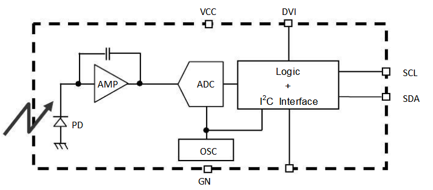

BH1750 主要由 PD（由光敏二极管组成）、集成运算放大器、模数转换器、光强计算部分及IIC通信接口等组成。
光敏二极管是将光信号变成电信号的半导体器件，核心部分是一个PN结，PN结具有单向导电性，工作的时候需要加上反向电压，无光照时，有很小的饱和反向漏电流，此时光敏二极管截止。当收到光照时，饱和反向漏电流增加，形成光电流且随着光强增大而增大。

BH1750 基于光照强弱，改变电路中的电流，然后利用运算放大器将电流放大，再由模数装换器将模拟信号转换为数字信号，通过计算模块计算后放入芯片相应的寄存器里面，供其他主控通过 IIC 通信接口读取光强数据。

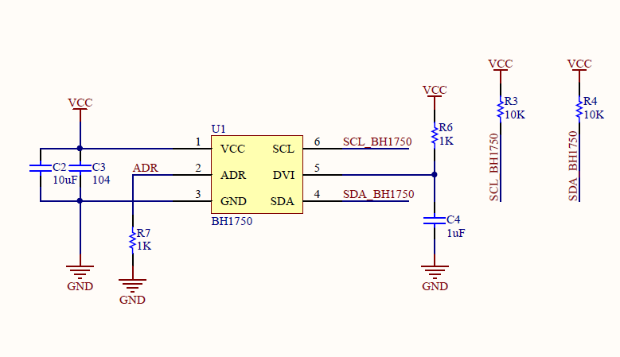

BH1750的外围电路比较简单，除了ADR引脚接1K电阻接地，DVI接1K上拉之外就只需要接IIC两个引脚的上拉电阻了。

BH1750 代码配置

打开Hardware目录下的BH1750.C文件

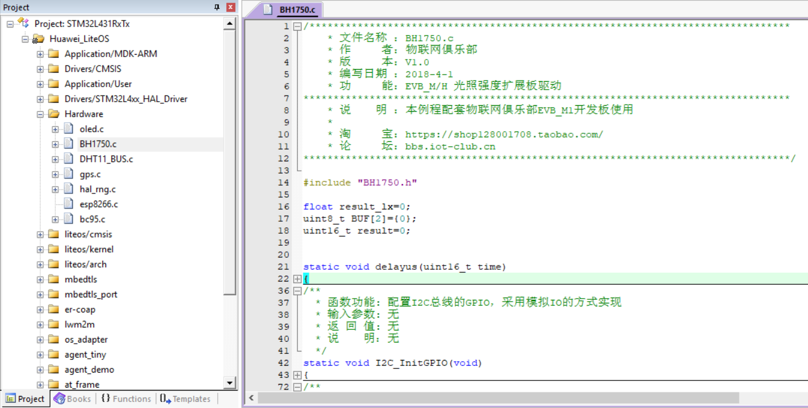

这里我们使用的是软件模拟IIC来驱动传感器，所以只需初始化对应的IO口即可

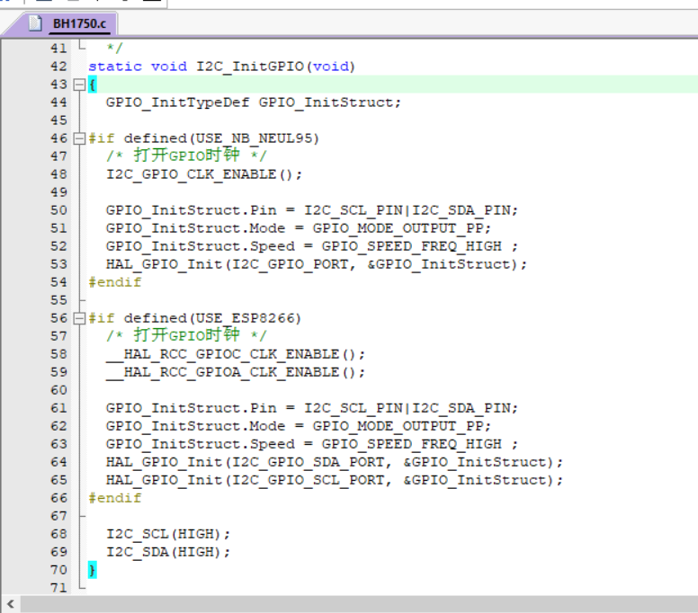

再调用I2C_Start、I2C_SendByte、I2C_Stop等模拟IIC函数即可实现对传感器寄存器数据的读写，并读取光照强度数据。

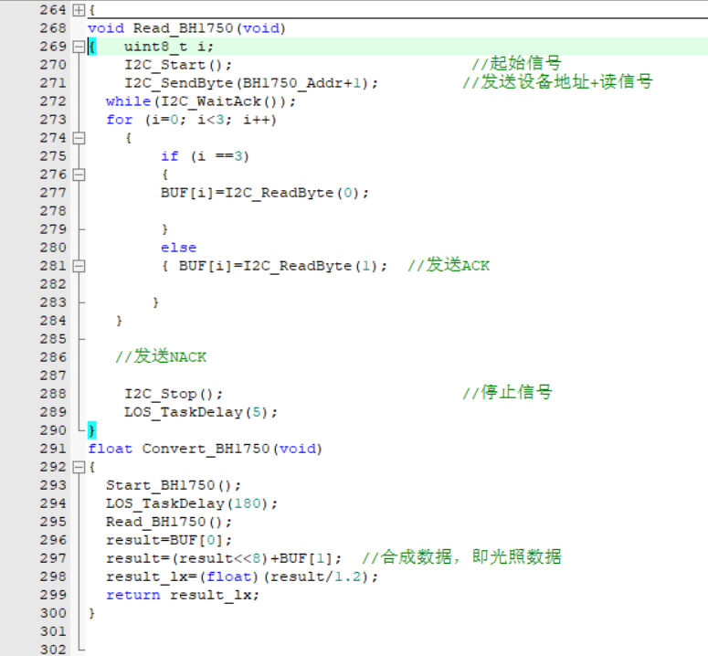

## 编写传感器数据采集任务回调函数

打开nb-iot_demo目录下的nb-iot_demo.c文件

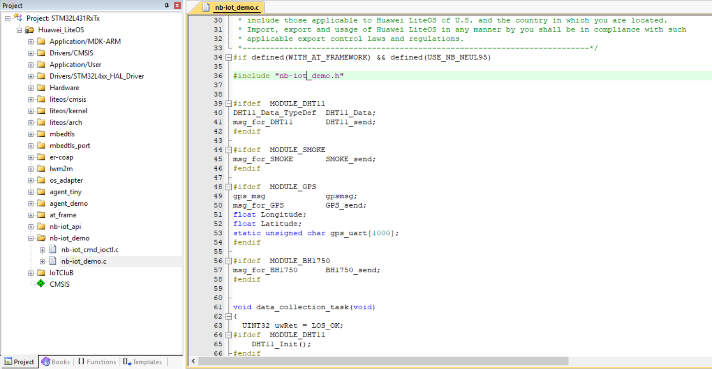

可以看到这个demo涵盖了温湿度检测、智慧烟感、GPS定位、智慧路灯四个案例，并在nb-iot_demo.h文件中通过宏定义来开启不同的案例。

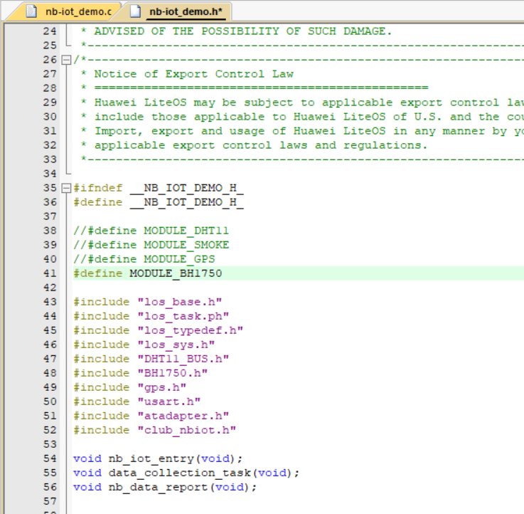

 在nb-iot_demo.c的126行左右的位置，通过调用Convert_BH1750() 函数实现对传感器数据的读取，并将数据存入 BH1750_send 结构体中用于后面通过 NB-IoT 模块发送数据。

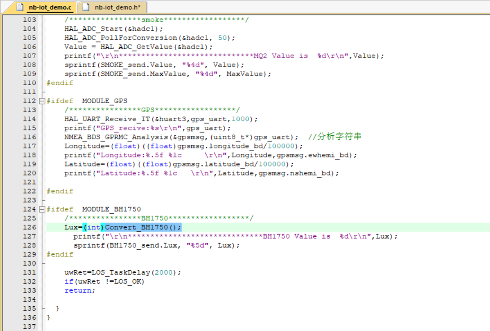

## 编写数据发送任务回调函数

在nb-iot_demo.c的179行左右的位置,通过调用club_nbiot_send函数将所要发送的传感器数据通过队列的形式发送到平台上。	

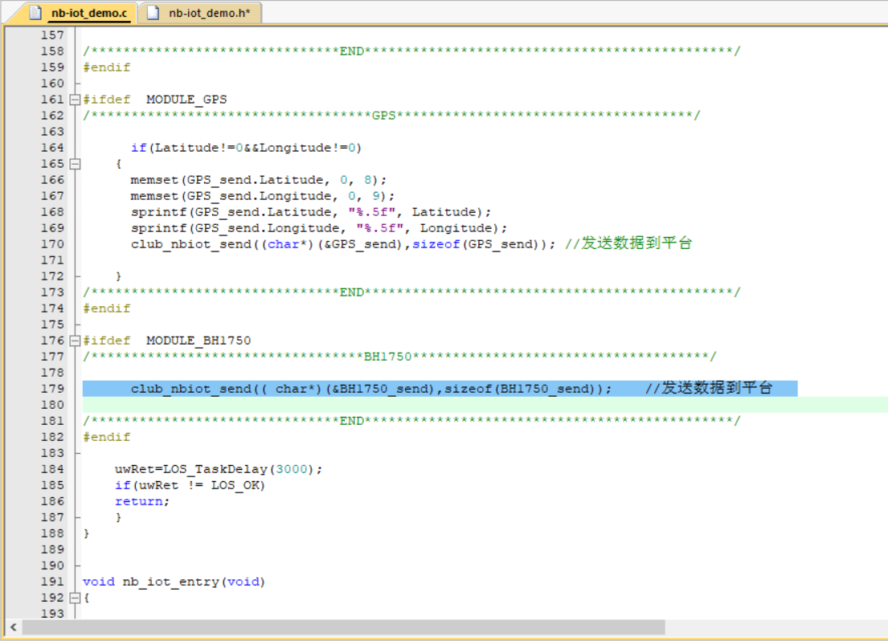

此处club_nbiot_send函数是将传感器数据以消息队列的方式发送的nbiot数据发送任务中，再通过nbiot数据发送任务将队列中的数据逐条发送出去，保证了数据的可靠性。

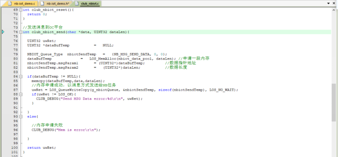

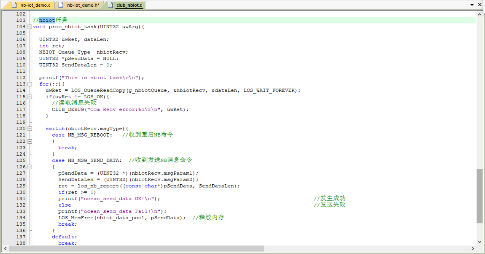

## 编写URC数据消息回调函数处理程序

打开nb-iot_demo目录下的nb-iot_cmd_ioctl.c文件

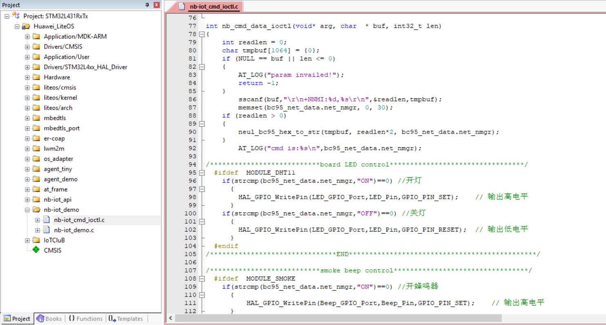

nb_cmd_data_ioctl函数是通过AT框架程序注册的平台下发指令URC数据的回调函数，只需在此函数中完成对下发指令的处理工作即可。

在nb-iot_cmd_ioctl.c文件的134行处通过分析平台的下发指令实现对扩展板的Light灯的控制


## 编写初始化NB-IoT模块函数

打开nb-iot_demo目录下的nb-iot_demo.c文件

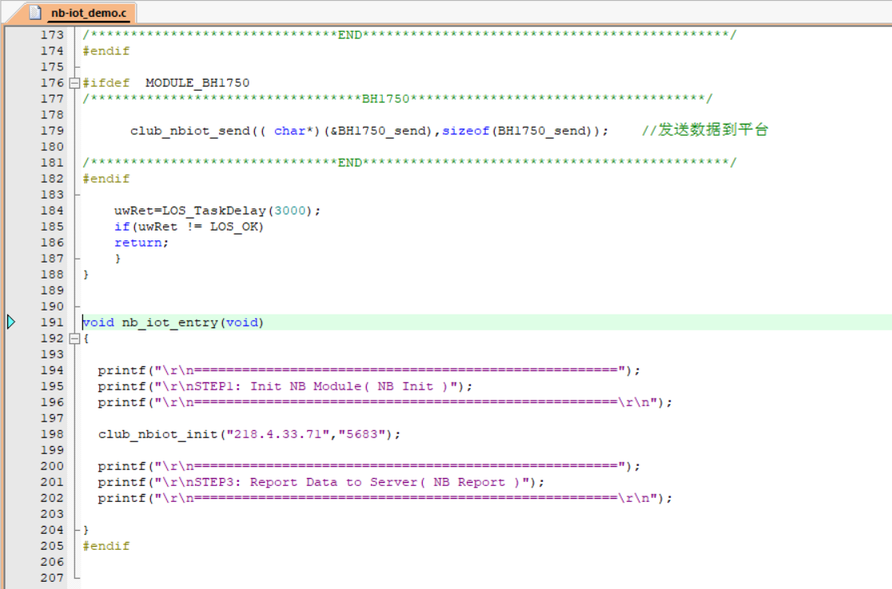

修改nb-iot_demo.c文件的198行的平台设备对接IP及端口即可实现对NB-IoT模块的初始化配置，平台设备对接IP及端口以申请平台时收到的邮件为准

至此已完成智慧路灯的设备程序的开发，编译程序并保存即可。

## 制作Profile

## 制作编解码插件

## NB-IoT模块对接平台

### 1. NB-IoT:AT指令解析

::: tip 注意
AT指令详细内容，请参阅NB模块指令集手册。
:::

### 2. 动手操作NB-IoT

- 这部分内容是：通过电脑串口调试软件，手动发AT指令，直接发给NB-IoT模块。NB模块返回的信息，直接到电脑串口调试软件。一步一步动手操作，实现连接OceanConnect平台。采用的通讯协议是CoAP协议。

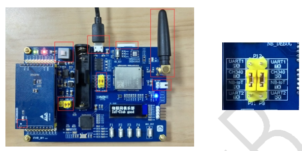

### 3. 开发板硬件接线

::: tip 注意
P12跳线帽和烧写器的接线方式
:::

### 4. NB-IoT与串口调试助手通信

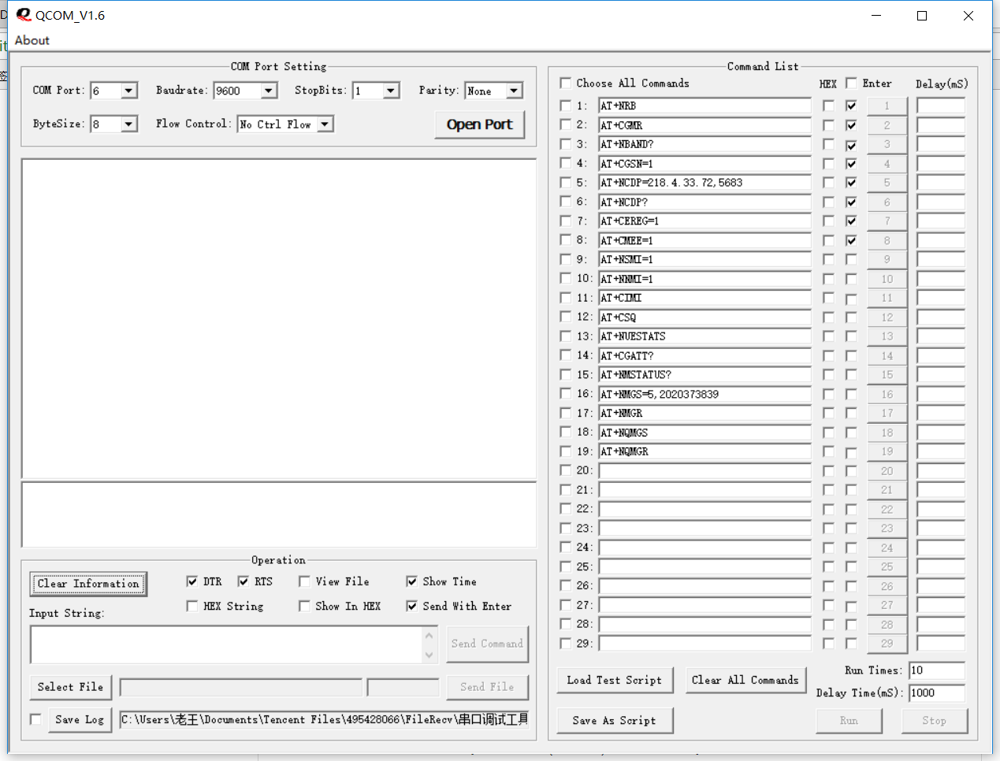

- 波特率：9600。串口号根据电脑实际情况选择,并点击Open Port


```
0???
REBOOT_CAUSE_APPLICATION_AT
Neul 
OK
```

- 命令2 发：AT+CGMR 【注意】当前模块最高版本为657SP5，日后版本或许还会有升级，若您此时模块版本低于657SP5，请参考模块升级教程进行升级。

```
SECURITY,V100R100C10B657SP5

PROTOCOL,V100R100C10B657SP5

APPLICATION,V100R100C10B657SP5

SEC_UPDATER,V100R100C10B657SP5

APP_UPDATER,V100R100C10B657SP5

RADIO,BC95HB-02-STD_850

OK
```

- 命令3 发：AT+NBAND?

```
+NBAND:5

OK
```

- 命令4 发：AT+CGSN=1 【注意】657SP2版本以上的模块，可以直接通过此命令，读取IMEI号。

```
+CGSN:863703330633304

OK
```

- 命令5 发：AT+NCDP=218.4.33.72,5683 【注意】若是其他华为云平台，请修改为相应IP和端口号。

```
OK
```

- 命令6 发：AT+NCDP?

```
+NCDP:218.4.33.72,5683

OK
```

- 命令7 发：AT+CEREG=1

```
OK
```

- 命令8 发：AT+CMEE=1 【注意】此处打开详细错误代码功能。不开启的话，若出现问题则统一返回ERROR。

```
OK
```

- 命令9 发：AT+NSMI=1

```
OK
```

- 命令10 发：AT+NNMI=1

```
OK
```

- 命令11 发：AT+CIMI

```
460111176313522

OK
```

- 命令12 发：AT+CSQ

```
+CSQ:25,99

OK
```

- 命令13 发：AT+NUESTATS

```
Signal power:-718
Total power:-625
TX power:-30
TX time:652
RX time:22771
Cell ID:67208020
ECL:1
SNR:38
EARFCN:2507
PCI:301
RSRQ:-125

OK
```

- 命令14 发：AT+CGATT?

```
+CGATT:1

OK
```

- 命令15 发：AT+NMSTATUS? 【注意】此命令用于测试NB模块与IoT平台的连接情况。第一次通过AT+NMGS命令发送上报数据时，若返回513错误 “+CME ERROR: 513”，则需要查询AT+NMSTATUS?，直到模块返回+NMSTATUS:MO_DATA_ENABLED，表示NB模块与IoT平台已经连接。

```
+NMSTATUS:MO_DATA_ENABLED

OK
```

- 命令16 发：AT+NMGS=5,2020373839 【注意】上报数据：789

```
OK

+NSMI:SENT
```

- 命令17 发：AT+NMGR【注意】此命令用于读取下发的命令

- 命令18 发：AT+NQMGS

```
PENDING=0,SENT=6,ERROR=0

OK
```

- 命令19 发：AT+NQMGR

```
BUFFERED=0,RECEIVED=0,DROPPED=0

OK
```

### 5. 注册NB-IoT设备

- 点击右上角“注册设备”。准备注册一个真实的NB-IoT设备。

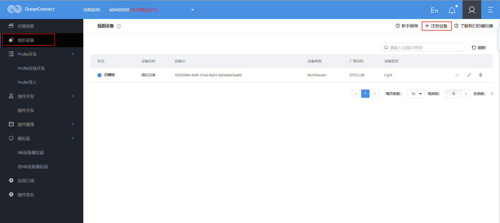

- 选择对应的profile

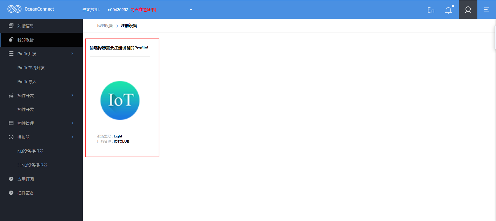

- 填写设备信息

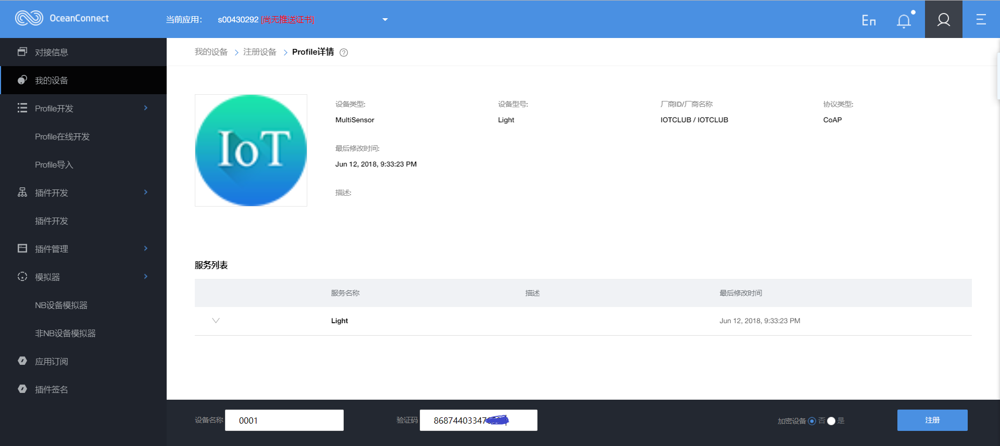

::: tip 注意
此处设备标识码要填写NB-IoT模块的IMEI号。有2个方法获取IMEI号，可以从模块上直接看到，也可以通过AT+CGSN=1指令读出来。（推荐使用AT指令读取的方式）
:::

### 6. NB-IoT与OceanConnect云平台联合调试

- 命令16 发： AT+NMGS=5,2020373839 【注意】上报数据：789。

【注意】如果指令返回ERROR或+CME ERROR: 513，那么重启模块等30秒后再发即可。

- 此时可以在OceanConnect平台，查看真实NB设备，已经绑定。点击设备，进去查看历史数据。


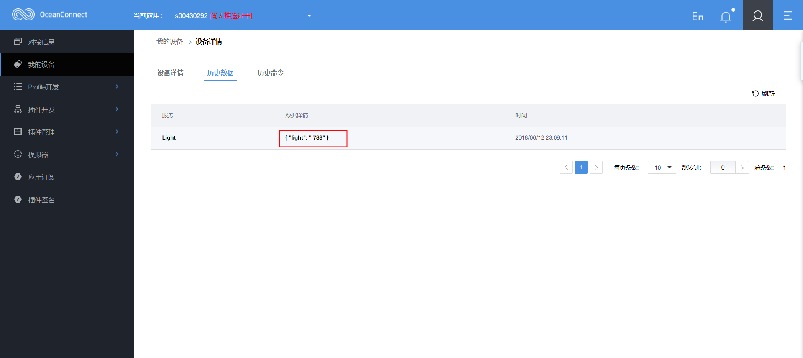

- 此时在串口调试软件中，命令AT+NQMGS，命令AT+NQMGR 可以查看已发送消息统计、已接收消息统计

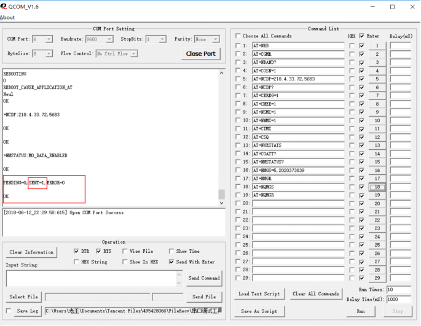

### 7. OceanConnect平台下发命令到NB-IoT模块

- 【注意】由于NB-IoT模块的PSM省电模式，OceanConnect平台不会立即下发命令，而是等待NB-IoT模块上发一条数据后，此时才会将缓存在云平台上的命令下发。所以，在测试IoT云平台下发命令功能时，每次下发命令前，需要先通过NB模块上发一条数据。具体操作是：通过串口调试软件，发送AT+NMGS=5,2020333435，此时在云平台点击命令下发。

- 在OceanConnect平台，点击设备，进去查看历史命令。由于此时还没有下发命令，所以此次数据为空白。

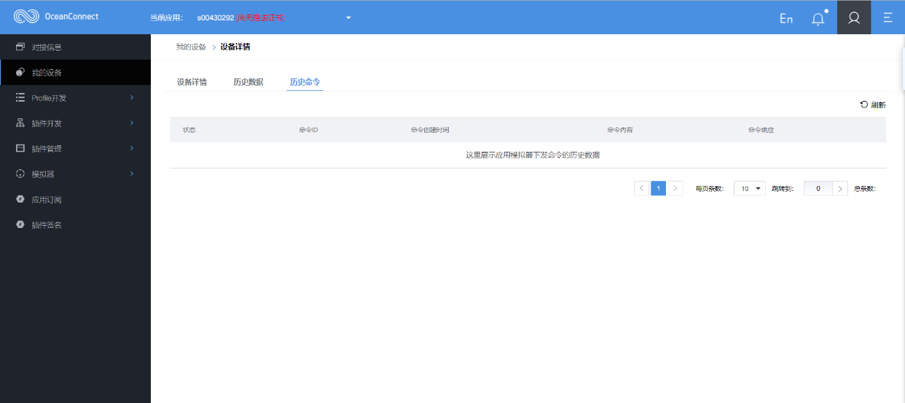

- 回到设备列表。点击图标，进入下发命令界面

- 设置LED下发控制命令。【注意：在点发送之前，最好使用AT+NMGS=5,2020333435，先上报一条数据】。点击发送命令

- IoT云平台下发1次命令，串口调试助手接收到1次数据。

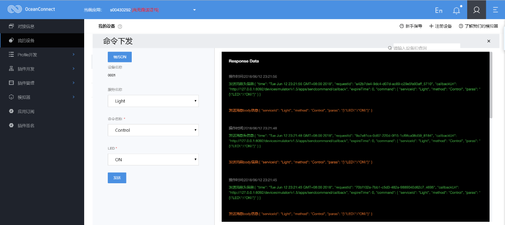

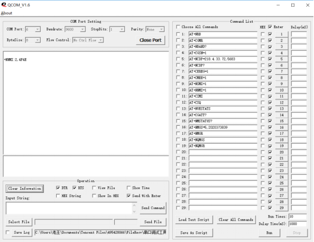

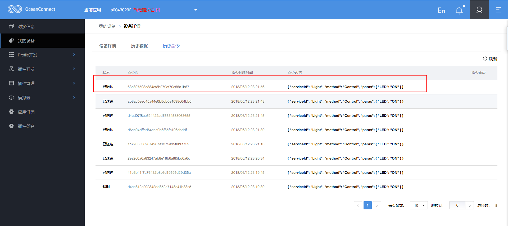

- 至此，完成NB-IoT模块连接OceanConnect平台动手内容

## LiteOS调测

### 1. 开发板硬件连接

- 确认图中几个位置是否连接正确。

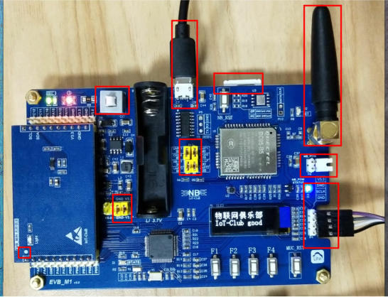

注意：P12跳线帽和烧写器的接线方式。


### 2. 打开MDK523项目

- 进入targets\STM32L431RxTx_IoTClub\MDK-ARM，打开STM32L431RxTx.uvprojx


### 3. 下载运行

- 配置环境

Step 1

## 体验手机APP

### 1. 获取手机APP

- 文件目录

### 2. 安装APP

### 3. 登陆APP

【注意】根据OceanConnect账号邮件的内容来填写。

### 4. APP实时显示数据